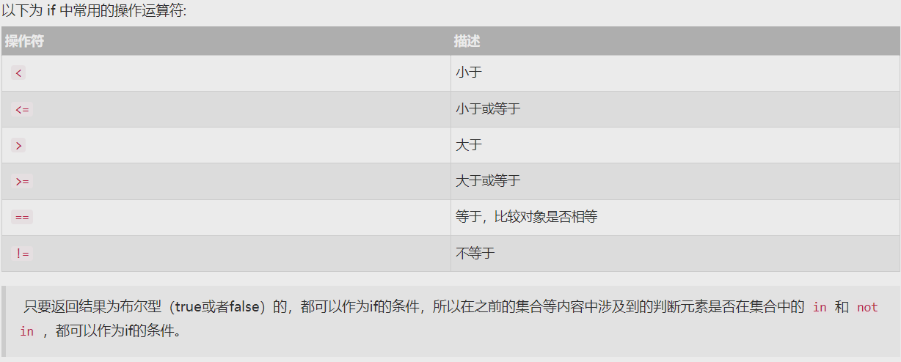

## 1：if语句
Python条件语句是通过 `一条` 或 `多条语句` 的执行结果( `True` 或者 `False` )来决定执行的代码块。
Python 中 if 语句的一般形式如下所示：

```python
if condition_1:
    statement_block_1
elif condition_2:
    statement_block_2
else:
    statement_block_3
```


**注意**：

- 1、每个条件后面要使用冒号（:），表示接下来是满足条件后要执行的语句块。
- 2、使用`缩进`来划分语句块，相同缩进数的语句在一起组成一个语句块。
- 3、在 Python 中没有`switch – case`语句，但在python3.10中添加了用法类似 `match-case`语句。

## 2：match-case语句（python3.10新特性）

在其他语言（比如说经典的C语言）中有一种多分支条件判断语句，可以进行模式匹配（通俗的讲，就是将传入的内容跟多个已存在的样例进行比较，找到相同的案例并按照该案例的代码进行处理，如果没有相同案例就按默认案例进行处理，可以查看其他编程语言的条件语句的Switch相关部分内容进行比较参考）。在python3.10中也引入了这样的新特性。

```python
match variable: #这里的variable是需要判断的内容
    case ["quit"]: 
        statement_block_1 # 对应案例的执行代码，当variable="quit"时执行statement_block_1
    case ["go", direction]: 
        statement_block_2
    case ["drop", *objects]: 
        statement_block_3
    ... # 其他的case语句
    case _: #如果上面的case语句没有命中，则执行这个代码块，类似于Switch的default
        statement_block_default
```

一个match语句的使用示例：

```python
def http_error(status):
    match status:
        case 400:
            return "Bad request"
        case 404:
            return "Not found"
        case 418:
            return "I'm a teapot"
        case _:
            return "Something's wrong with the Internet"
```

 上述代码等价于：

```python
def http_error(status):
    if status == 400:
        return "Bad request"
    elif status == 404:
        return "Not found"
    elif status == 418:
        return "I'm a teapot"
    else:
        return "Something's wrong with the Internet"
```

## 3：实例
以下实例演示了狗的年龄计算判断：

```python
age = int(input("Age of the dog: "))
print()
if age < 0:  
    print("This can hardly be true!") 
elif age == 1:  
    print("about 14 human years") 
elif age == 2:  
    print("about 22 human years") 
elif age > 2:
    human = 22 + (age -2)*5
    print("Human years: ", human)

### 
input('press Return>')
```



使用 `​in` ​和 `​not in` ​作为判断条件：

```python
thisset = set(("Google", "W3Cschool", "Taobao"))
if "W3Cschool" in thisset:
    print("该元素在列表中")
if "baidu" not in thisset:
    print("该元素不在列表中")
```

以下示例使用if语句来实现一个猜数字游戏（建议在本地环境尝试）：

```python
#!/usr/bin/python3 
# 该实例演示了数字猜谜游戏
number = 7
guess = -1
print("猜数字!")
while guess != number:
    guess = int(input("请输入你要猜的数字"))
    if guess == number:
        print("你猜中了，真厉害！")
    elif guess < number:
        print("猜小了，再猜猜？")
    elif guess > number:
        print("猜大了，在猜猜？")
```