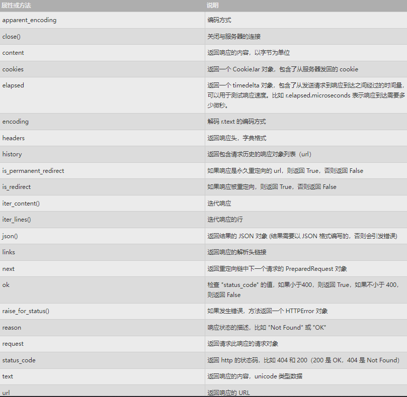

安装 requests

```shell
pip install requests
```

## 1：简单示例
request的使用相比于 `urllib` 简洁了很多，如下所示：

```python
# 导入 requests 包
import requests

# 发送请求
x = requests.get('https://www.w3cschool.cn/')

# 返回网页内容
print(x.text)
```

每次调用 `requests` 请求之后，会返回一个 `response` 对象，该对象包含了具体的响应信息。

响应信息如下：


```python
# 导入 requests 包
import requests

# 发送请求
x = requests.get('https://www.w3cschool.cn/')

# 返回 http 的状态码
print(x.status_code)

# 响应状态的描述
print(x.reason)

# 返回编码
print(x.apparent_encoding)
```

输出结果如下：

```python
200
OK
utf-8
```
请求 `json` 数据文件，返回 `json` 内容：
```python
# 导入 requests 包
import requests

# 发送请求
x = requests.get('https://www.w3cschool.cn/try/ajax/json_demo.json')

# 返回 json 数据
print(x.json())
```

结果如下
```python
{'name': '网站', 'num': 3, 'sites': [{'name': 'Google', 'info': ['Android', 'Google 搜索', 'Google 翻译']}, {'name': 'w3cschool', 'info': ['编程狮', '编程狮工具', '编程狮微信']}, {'name': 'Taobao', 'info': ['淘宝', '网购']}]}

```

## 2：requests 方法


### 1）get 请求
使用 `requests.request()` 发送 `get` 请求：

```python
# 导入 requests 包
import requests

# 发送请求
x = requests.request('get', 'https://www.w3cschool.cn/')

# 返回网页内容
print(x.status_code)  # 200
```

### 2）get 请求 设置请求头且带参数
```python
# 导入 requests 包
import requests

 
kw = {'w':'python 教程'}

# 设置请求头
headers = {"User-Agent": "Mozilla/5.0 (Windows NT 10.0; Win64; x64) AppleWebKit/537.36 (KHTML, like Gecko) Chrome/54.0.2840.99 Safari/537.36"}
 
# params 接收一个字典或者字符串的查询参数，字典类型自动转换为url编码，不需要urlencode()
response = requests.get("https://www.w3cschool.cn/search/", params = kw, headers = headers)

# 查看响应状态码
print (response.status_code)

# 查看响应头部字符编码
print (response.encoding)

# 查看完整url地址
print (response.url)

# 查看响应内容，response.text 返回的是Unicode格式的数据
print(response.text)
```

输出结果如下：

```python
200
UTF-8
https://www.w3cschool.cn/search/?w=python+%E6%95%99%E7%A8%8B

... 其他内容...
```

### 3）post 请求
`post()` 方法可以发送 `POST` 请求到指定 `url`，一般格式如下：

```python
requests.post(url, data={key: value}, json={key: value}, args)
```
- ***`url`***   请求 url。
- ***`data`***  参数为要发送到指定 url 的字典、元组列表、字节或文件对象。
- ***`json`***  参数为要发送到指定 url 的 JSON 对象。
- ***`args`***  为其他参数，比如 cookies、headers、verify等。

```python
# 导入 requests 包
import requests

# 发送请求
x = requests.post('https://www.w3cschool.cn/try/ajax/demo_post.php')

# 返回网页内容
print(x.text)
```

输出结果如下：

```python
<p style='color:red;'>本内容是使用 POST 方法请求的。</p><p style='color:red;'>请求时间：
2022-05-26 17:30:47</p>
```

### 4：post 请求带参数：

```python
# 导入 requests 包
import requests

# 表单参数，参数名为 fname 和 lname
myobj = {'fname': 'w3cschool','lname': 'Boy'}

# 发送请求
x = requests.post('https://www.w3cschool.cn/try/ajax/demo_post2.php', data = myobj)

# 返回网页内容
print(x.text)
```

输出结果如下：

```python
<p style='color:red;'>你好，w3cschool Boy，今天过得怎么样？</p>
```

## 3：自测get 和 post 请求

### 1）get请求

java接口
```java
    @ApiOperation("根据ID查询用户信息")
    @GetMapping("/getUserById/{id}")
    public R getUserById(@PathVariable("id") String id){
        User user = userService.getById(id);
        return user != null ? R.ok().data("userinfo",user) : R.error().data("userinfo","用户不存在");
    }
```

python 进行调用
```python
import requests, json

# 定义请求参数
id = '43'
# 发送请求
x = requests.get('http://localhost:8160/user/getUserById/'+id)

# 返回网页内容
print(x.text)   # 此时是json对象
print(json.loads(x.text)) # 此时已经解码成为字典
print(json.loads(x.text)['data']['userinfo']['userId']) # 获取某一个属性的值
```
结果是：
```python
{"success":true,"code":20000,"message":"成功","data":{"userinfo":{"userId":43,"username":"lbxueh8de5","password":"929475e4dea2f18b9aa6c41bd63bd3eb","mobile":"18909132452","introduction":"在奋斗的路上奔跑，不是在退步的路上坚持","school":"清华大学","email":"2775194510@qq.com","sex":false,"pic":"https://cube.elemecdn.com/0/88/03b0d39583f48206768a7534e55bcpng.png","status":1,"deleted":0,"score":3.0,"created":1668675032000,"lastlogintime":1668675032000}}}
{'success': True, 'code': 20000, 'message': '成功', 'data': {'userinfo': {'userId': 43, 'username': 'lbxueh8de5', 'password': '929475e4dea2f18b9aa6c41bd63bd3eb', 'mobile': '18909132452', 'introduction': '在奋斗的路上奔跑，不是在退步的路上坚持', 'school': '清华大学', 'email': '2775194510@qq.com', 'sex': False, 'pic': 'https://cube.elemecdn.com/0/88/03b0d39583f48206768a7534e55bcpng.png', 'status': 1, 'deleted': 0, 'score': 3.0, 'created': 1668675032000, 'lastlogintime': 1668675032000}}}
43
```

### 2）post请求
java接口
```java
    @ApiOperation("添加用户信息加密处理")
    // @CryptoJSRequired
    @PostMapping("/addUser1")
    public R AddUserInfo1(@RequestBody User user) {
        System.out.println("进入方法-------------");
        System.out.println(user);
        return R.ok().message("添加成功").data("name", "22222");
    }
```

python 进行调用
```python
import requests, json

# 定义请求参数
url = 'http://localhost:8160/user/addUser1'
user = {
    "userId": "132456",
    "username": "xiaoze",
    "password": "12465798"
}

headers = {
    "Content-Type": "application/json"
}
# 发送请求 (在发送请求之前一定要把字典对象转换成json对象)
x = requests.post(url,data=json.dumps(user),headers=headers)

# 返回网页内容
print(x.text)   # 此时是json对象
print(json.loads(x.text)['data'])  # 直接返回的是json对象，要先将其转换成为字典对象，再进行取值
```
```python
{"success":true,"code":20000,"message":"添加成功","data":{"name":"22222"}}
{'name': '22222'}
```