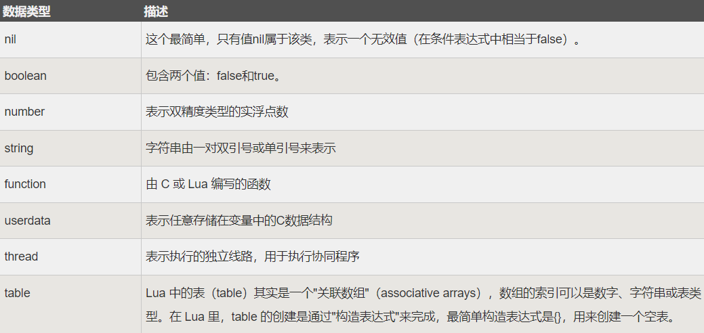

[学习网站](https://www.runoob.com/lua/lua-environment.html)

## 1：linux环境配置
```linux
curl -R -O http://www.lua.org/ftp/lua-5.3.0.tar.gz
tar zxf lua-5.3.0.tar.gz
cd lua-5.3.0
make linux test
make install
```
## 2：基本语法
> windows和linux语法一直，但是需要在Linux文件中加入头`#!/usr/local/bin/lua`,之后语法以Windows为例。
### 1）基本数据类型
Lua 中有 8 个基本类型分别为：`nil`、`boolean`、`number`、`string`、`userdata`、`function`、`thread` 和 `table`。

我们可以使用 type 函数测试给定变量或者值的类型：

```lua
print(type("Hello world"))      --> string
print(type(10.4*3))             --> number
print(type(print))              --> function
print(type(type))               --> function
print(type(true))               --> boolean
print(type(nil))                --> nil
print(type(type(X)))            --> string
```

<p style="color:red">nil（空）</p>

nil 类型表示一种没有任何有效值，它只有一个值 -- nil，例如打印一个没有赋值的变量，便会输出一个 nil 值：
```lua
print(type(a))
-- nil
```

<p style="color:red">boolean（布尔）</p>

boolean 类型只有两个可选值：true（真） 和 false（假），Lua 把 false 和 nil 看作是 false，其他的都为 true，数字 0 也是 true:

```lua
print(type(true))
print(type(false))
print(type(nil))
 
if false or nil then
    print("至少有一个是 true")
else
    print("false 和 nil 都为 false")
end

if 0 then
    print("数字 0 是 true")
else
    print("数字 0 为 false")
end

--boolean
--boolean
--nil
--false 和 nil 都为 false
--数字 0 是 true
```

<p style="color:red">number（数字）</p>

Lua 默认只有一种 number 类型 -- double（双精度）类型（默认类型可以修改 luaconf.h 里的定义），以下几种写法都被看作是 number 类型：
```lua
print(type(2))
print(type(2.2))
print(type(0.2))
print(type(2e+1))
print(type(0.2e-1))
print(type(7.8263692594256e-06))
--number
--number
--number
--number
--number
--number
```

<p style="color:red">string（字符串）</p>

nil 类型表示一种没有任何有效值，它只有一个值 -- nil，例如打印一个没有赋值的变量，便会输出一个 nil 值：
```lua
string1 = "this is string1"
string2 = 'this is string2'

html = [[
<html>
<head></head>
<body>
    <a href="http://www.baidu.com/">百度</a>
</body>
</html>
]]
print(html)

--<html>
--<head></head>
--<body>
--   <a href="http://www.baidu.com/">百度</a>
--</body>
--</html>

```

<p style="color:red">table（表）</p>

在 Lua 里，table 的创建是通过"构造表达式"来完成，最简单构造表达式是{}，用来创建一个空表。也可以在表里添加一些数据，直接初始化表:
```lua
-- 创建一个空的 table
local tbl1 = {}
 
-- 直接初始表
local tbl2 = {"apple", "pear", "orange", "grape"}

-- table_test2.lua 脚本文件
local tbl = {"apple", "pear", "orange", "grape"}
for key, val in pairs(tbl) do
    print("Key", key)
end

--Key    1
--Key    2
--Key    3
--Key    4
```

<p style="color:red">function（函数）</p>

在 Lua 中，函数是被看作是"第一类值（First-Class Value）"，函数可以存在变量里:

```lua
-- function_test.lua 脚本文件
function factorial1(n)
    if n == 0 then
        return 1
    else
        return n * factorial1(n - 1)
    end
end
print(factorial1(5))
factorial2 = factorial1
print(factorial2(5))

--120
--120
```

<p style="color:red">thread（线程）</p>

在 Lua 里，最主要的线程是协同程序（coroutine）。它跟线程（thread）差不多，拥有自己独立的栈、局部变量和指令指针，可以跟其他协同程序共享全局变量和其他大部分东西。

线程跟协程的区别：线程可以同时多个运行，而协程任意时刻只能运行一个，并且处于运行状态的协程只有被挂起（suspend）时才会暂停。

<p style="color:red">userdata（自定义类型）</p>
userdata 是一种用户自定义数据，用于表示一种由应用程序或 C/C++ 语言库所创建的类型，可以将任意 C/C++ 的任意数据类型的数据（通常是 struct 和 指针）存储到 Lua 变量中调用。
