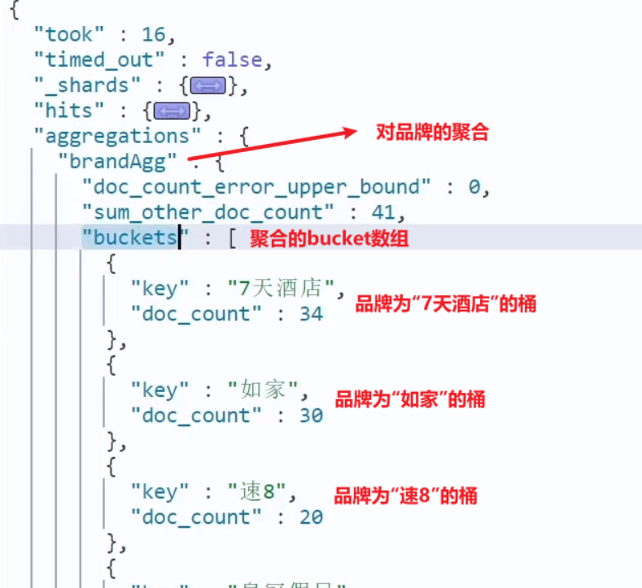
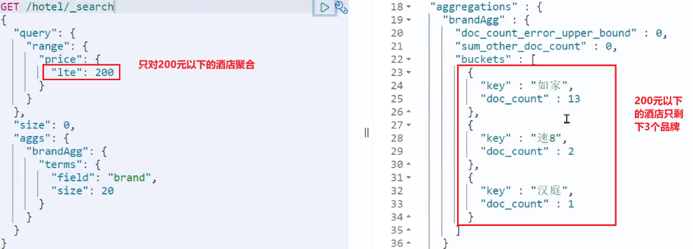
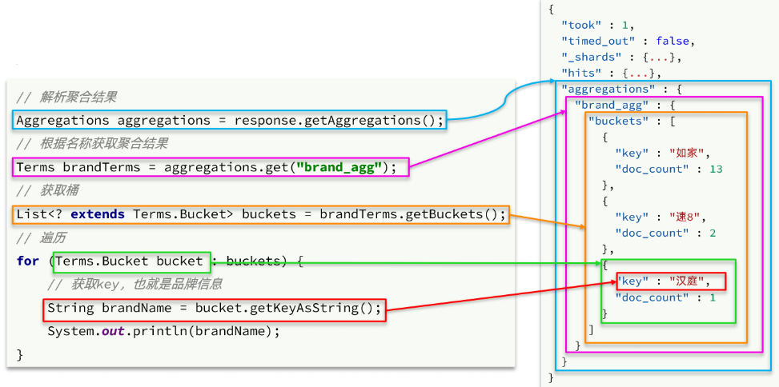
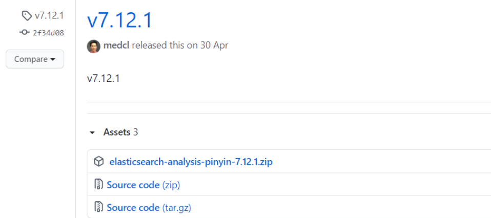
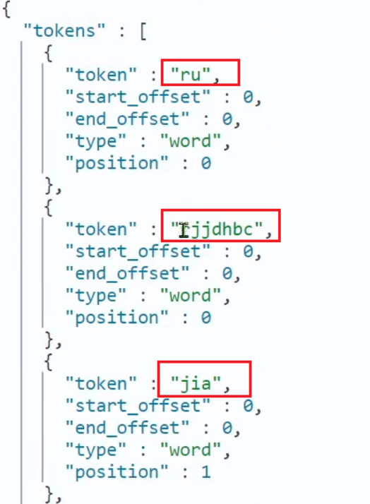
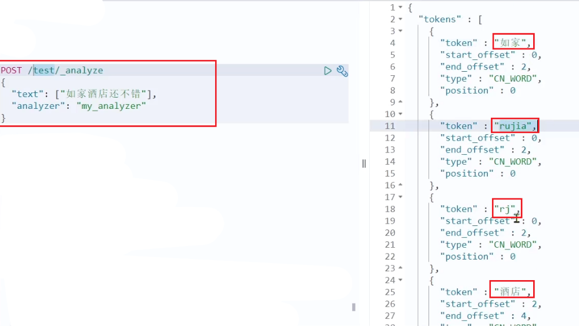
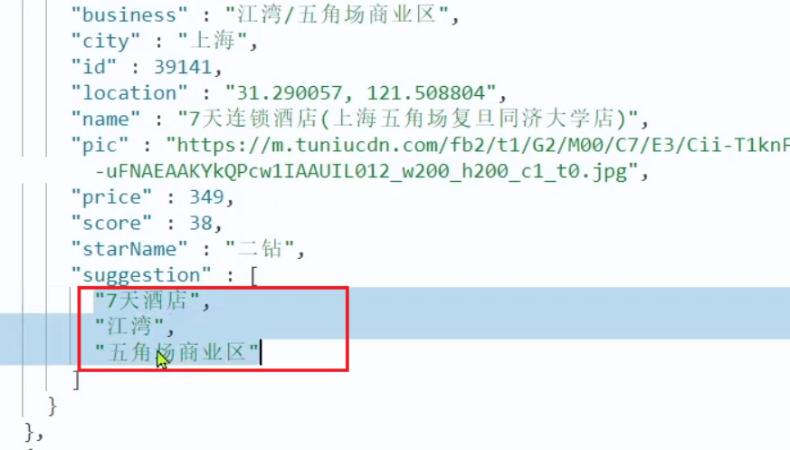
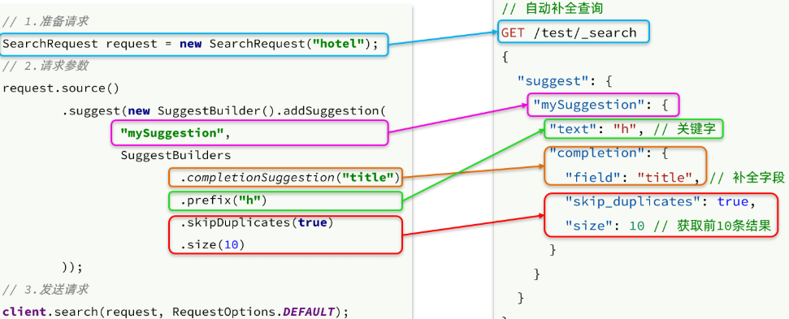
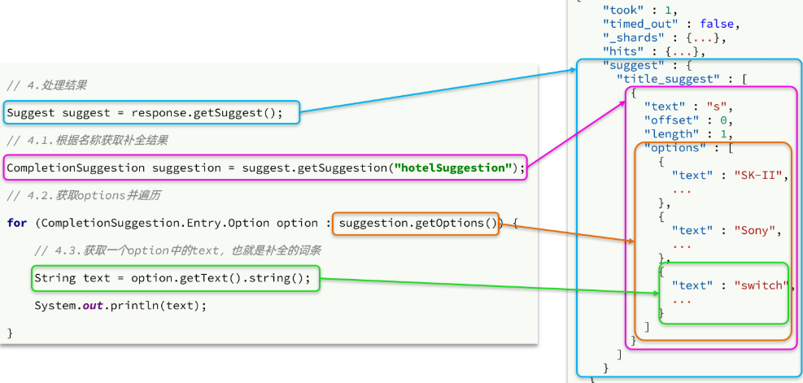

## 1：聚合的种类

聚合常见的有三类：

- **桶（Bucket）聚合** ：用来对文档做分组
  - `TermAggregation`：按照文档字段值分组，例如按照品牌值分组、按照国家分组
  - `Date Histogram`：按照日期阶梯分组，例如一周为一组，或者一月为一组

- **度量（Metric）聚合**：用以计算一些值，比如：最大值、最小值、平均值等
  - `Avg`：求平均值
  - `Max`：求最大值
  - `Min`：求最小值
  - `Stats`：同时求 `max`、`min`、`avg`、`sum`等
- **管道（pipeline）聚合**：其它聚合的结果为基础做聚合


> **注意：**参加聚合的字段必须是 `keyword`、`日期`、`数值`、`布尔类型`


## 2：DSL实现聚合

现在，我们要统计所有数据中的酒店品牌有几种，其实就是按照品牌对数据分组。**此时可以根据酒店品牌的名称做聚合**，也就是 `Bucket` 聚合。

### 2.1 Bucket聚合语法

语法如下：

```json
GET /hotel/_search
{
  "size": 0,  // 设置size为0，结果中不包含文档，只包含聚合结果
  "aggs": { // 定义聚合
    "brandAgg": { //给聚合起个名字
      "terms": { // 聚合的类型，按照品牌值聚合，所以选择term
        "field": "brand", // 参与聚合的字段
        "size": 20 // 希望获取的聚合结果数量
      }
    }
  }
}
```

结果如图：



### 2.2 聚合结果排序

默认情况下，`Bucket` 聚合会统计 `Bucket` 内的文档数量，记为 `_count` ，并且按照 `_count`降序排序。

我们可以指定order属性，自定义聚合的排序方式：

```json
GET /hotel/_search
{
  "size": 0, 
  "aggs": {
    "brandAgg": {
      "terms": {
        "field": "brand",
        "order": {
          "_count": "asc" // 按照_count升序排列
        },
        "size": 20
      }
    }
  }
}
```

### 2.3 限定聚合范围

默认情况下，`Bucket` 聚合是对索引库的所有文档做聚合，但真实场景下，用户会输入搜索条件，因此聚合必须是对搜索结果聚合。那么聚合必须添加限定条件。

我们可以限定要聚合的文档范围，只要添加 `query` 条件即可：


```json
GET /hotel/_search
{
  "query": {
    "range": {
      "price": {
        "lte": 200 // 只对200元以下的文档聚合
      }
    }
  }, 
  "size": 0, 
  "aggs": {
    "brandAgg": {
      "terms": {
        "field": "brand",
        "size": 20
      }
    }
  }
}
```

这次，聚合得到的品牌明显变少了：



### 2.4 Metric聚合语法

我们对酒店按照品牌分组，形成了一个个桶。现在我们需要对桶内的酒店做运算，获取每个品牌的用户评分的`min`、`max`、`avg`等值。

这就要用到 `Metric` 聚合了，例如 `stat` 聚合：就可以获取 `min`、`max`、`avg`等结果。

语法如下：

```json
GET /hotel/_search
{
  "size": 0, 
  "aggs": {
    "brandAgg": { 
      "terms": { 
        "field": "brand", 
        "size": 20
      },
      "aggs": { // 是brands聚合的子聚合，也就是分组后对每组分别计算
        "score_stats": { // 聚合名称
          "stats": { // 聚合类型，这里stats可以计算min、max、avg等
            "field": "score" // 聚合字段，这里是score
          }
        }
      }
    }
  }
}
```

这次的 `score_stats` 聚合是在 `brandAgg` 的聚合内部嵌套的子聚合。因为我们需要在每个桶分别计算。

另外，我们还可以给聚合结果做个排序，例如按照每个桶的酒店平均分做排序：


### 2.5 小结

aggs代表聚合，与query同级，此时query的作用是？

- 限定聚合的的文档范围

**聚合必须的三要素：**

- 聚合名称
- 聚合类型
- 聚合字段

**聚合可配置属性有：**

- `size`：指定聚合结果数量
- `order`：指定聚合结果排序方式
- `field`：指定聚合字段


## 3：RestAPI实现聚合

### 3.1 API语法

聚合条件与 `query` 条件同级别，因此需要使用 `request.source()` 来指定聚合条件。

聚合条件的语法：


聚合的结果也与查询结果不同，API也比较特殊。不过同样是JSON逐层解析：



### 3.2 业务需求

需求：搜索页面的品牌、城市等信息不应该是在页面写死，而是通过聚合索引库中的酒店数据得来的：


使用聚合功能，利用Bucket聚合，对搜索结果中的文档基于品牌分组、基于城市分组，就能得知包含哪些品牌、哪些城市了。

因为是对搜索结果聚合，因此聚合是**限定范围的聚合**，也就是说聚合的限定条件跟搜索文档的条件一致。


结果是一个Map结构：

- key是字符串，城市、星级、品牌、价格
- value是集合，例如多个城市的名称

### 3.3 业务实现

```java
    @PostMapping("filters")
    public Map<String, List<String>> getFilters(@RequestBody RequestParams params){
        return hotelService.getFilters(params);
    }
```

```java
@Override
public Map<String, List<String>> filters(RequestParams params) {
    try {
        // 1.准备Request
        SearchRequest request = new SearchRequest("hotel");
        // 2.准备DSL
        // 2.1.query
        buildBasicQuery(params, request);
        // 2.2.设置size
        request.source().size(0);
        // 2.3.聚合
        buildAggregation(request);
        // 3.发出请求
        SearchResponse response = client.search(request, RequestOptions.DEFAULT);
        // 4.解析结果
        Map<String, List<String>> result = new HashMap<>();
        Aggregations aggregations = response.getAggregations();
        // 4.1.根据品牌名称，获取品牌结果
        List<String> brandList = getAggByName(aggregations, "brandAgg");
        result.put("品牌", brandList);
        // 4.2.根据品牌名称，获取品牌结果
        List<String> cityList = getAggByName(aggregations, "cityAgg");
        result.put("城市", cityList);
        // 4.3.根据品牌名称，获取品牌结果
        List<String> starList = getAggByName(aggregations, "starAgg");
        result.put("星级", starList);

        return result;
    } catch (IOException e) {
        throw new RuntimeException(e);
    }
}

private void buildAggregation(SearchRequest request) {
    request.source().aggregation(AggregationBuilders
                                 .terms("brandAgg")
                                 .field("brand")
                                 .size(100)
                                );
    request.source().aggregation(AggregationBuilders
                                 .terms("cityAgg")
                                 .field("city")
                                 .size(100)
                                );
    request.source().aggregation(AggregationBuilders
                                 .terms("starAgg")
                                 .field("starName")
                                 .size(100)
                                );
}

private List<String> getAggByName(Aggregations aggregations, String aggName) {
    // 4.1.根据聚合名称获取聚合结果
    Terms brandTerms = aggregations.get(aggName);
    // 4.2.获取buckets
    List<? extends Terms.Bucket> buckets = brandTerms.getBuckets();
    // 4.3.遍历
    List<String> brandList = new ArrayList<>();
    for (Terms.Bucket bucket : buckets) {
        // 4.4.获取key
        String key = bucket.getKeyAsString();
        brandList.add(key);
    }
    return brandList;
}
```

## 4：自动补全


当用户在搜索框输入字符时，我们应该提示出与该字符有关的搜索项，如图


这种根据用户输入的字母，提示完整词条的功能，就是自动补全了。

因为需要根据拼音字母来推断，因此要用到拼音分词功能。

### 4.1 拼音分词器
要实现根据字母做补全，就必须对文档按照拼音分词。在GitHub上恰好有elasticsearch的拼音分词插件。[地址：](https://github.com/medcl/elasticsearch-analysis-pinyin)




测试用法如下：
```json
POST /_analyze
{
  "text": "如家酒店还不错",
  "analyzer": "pinyin"
}
```
结果


### 4.2 自定义分词器

默认的拼音分词器会将每个汉字单独分为拼音，而我们希望的是每个词条形成一组拼音，需要对拼音分词器做个性化定制，形成自定义分词器。


`elasticsearch` 中分词器（ `analyzer` ）的组成包含三部分：

- `character filters`：在tokenizer之前对文本进行处理。例如删除字符、替换字符
- `tokenizer`：将文本按照一定的规则切割成词条（term）。例如keyword，就是不分词；还有ik_smart
- `tokenizer filter`：将tokenizer输出的词条做进一步处理。例如大小写转换、同义词处理、拼音处理等

文档分词时会依次由这三部分来处理文档：


声明自定义分词器的语法如下：

```json
PUT /test
{
  "settings": {
    "analysis": {
      "analyzer": { // 自定义分词器
        "my_analyzer": {  // 分词器名称
          "tokenizer": "ik_max_word",
          "filter": "py"
        }
      },
      "filter": { // 自定义tokenizer filter
        "py": { // 过滤器名称
          "type": "pinyin", // 过滤器类型，这里是pinyin
		  "keep_full_pinyin": false,
          "keep_joined_full_pinyin": true,
          "keep_original": true,
          "limit_first_letter_length": 16,
          "remove_duplicated_term": true,
          "none_chinese_pinyin_tokenize": false
        }
      }
    }
  },
  "mappings": {
    "properties": {
      "name": {
        "type": "text",
        "analyzer": "my_analyzer",
        "search_analyzer": "ik_smart"
      }
    }
  }
}
```

测试：



总结：

**如何使用拼音分词器？**

- ①下载pinyin分词器

- ②解压并放到elasticsearch的plugin目录

- ③重启即可

**如何自定义分词器？**

- ①创建索引库时，在settings中配置，可以包含三部分

- ②character filter

- ③tokenizer

- ④filter

**拼音分词器注意事项？**

- 为了避免搜索到同音字，搜索时不要使用拼音分词器

### 4.3 自动补全查询

elasticsearch提供了[Completion Suggester](https://www.elastic.co/guide/en/elasticsearch/reference/7.6/search-suggesters.html)查询来实现自动补全功能。这个查询会匹配以用户输入内容开头的词条并返回。为了提高补全查询的效率，对于文档中字段的类型有一些约束：

- 参与补全查询的字段必须是completion类型。

- 字段的内容一般是用来补全的多个词条形成的数组。

比如，一个这样的索引库：

```json
// 创建索引库
PUT test
{
  "mappings": {
    "properties": {
      "title":{
        "type": "completion"
      }
    }
  }
}
```

然后插入下面的数据：

```json
// 示例数据
POST test/_doc
{
  "title": ["Sony", "WH-1000XM3"]
}
POST test/_doc
{
  "title": ["SK-II", "PITERA"]
}
POST test/_doc
{
  "title": ["Nintendo", "switch"]
}
```

查询的DSL语句如下：

```json
// 自动补全查询
GET /test/_search
{
  "suggest": {
    "title_suggest": {
      "text": "s", // 关键字
      "completion": {
        "field": "title", // 补全查询的字段
        "skip_duplicates": true, // 跳过重复的
        "size": 10 // 获取前10条结果
      }
    }
  }
}
```

### 4.4 实现酒店搜索框自动补全

现在，我们的hotel索引库还没有设置拼音分词器，需要修改索引库中的配置。但是我们知道索引库是无法修改的，只能删除然后重新创建。

另外，我们需要添加一个字段，用来做自动补全，将brand、suggestion、city等都放进去，作为自动补全的提示。


因此，总结一下，我们需要做的事情包括：

1. 修改hotel索引库结构，设置自定义拼音分词器

2. 修改索引库的name、all字段，使用自定义分词器

3. 索引库添加一个新字段suggestion，类型为completion类型，使用自定义的分词器

4. 给HotelDoc类添加suggestion字段，内容包含brand、business

5. 重新导入数据到hotel库

#### 修改酒店映射结构

代码如下：

```json
// 酒店数据索引库
PUT /hotel
{
  "settings": {
    "analysis": {
      "analyzer": {
        "text_anlyzer": {
          "tokenizer": "ik_max_word",
          "filter": "py"
        },
        "completion_analyzer": {
          "tokenizer": "keyword",
          "filter": "py"
        }
      },
      "filter": {
        "py": {
          "type": "pinyin",
          "keep_full_pinyin": false,
          "keep_joined_full_pinyin": true,
          "keep_original": true,
          "limit_first_letter_length": 16,
          "remove_duplicated_term": true,
          "none_chinese_pinyin_tokenize": false
        }
      }
    }
  },
  "mappings": {
    "properties": {
      "id":{
        "type": "keyword"
      },
      "name":{
        "type": "text",
        "analyzer": "text_anlyzer",
        "search_analyzer": "ik_smart",
        "copy_to": "all"
      },
      "address":{
        "type": "keyword",
        "index": false
      },
      "price":{
        "type": "integer"
      },
      "score":{
        "type": "integer"
      },
      "brand":{
        "type": "keyword",
        "copy_to": "all"
      },
      "city":{
        "type": "keyword"
      },
      "starName":{
        "type": "keyword"
      },
      "business":{
        "type": "keyword",
        "copy_to": "all"
      },
      "location":{
        "type": "geo_point"
      },
      "pic":{
        "type": "keyword",
        "index": false
      },
      "all":{
        "type": "text",
        "analyzer": "text_anlyzer",
        "search_analyzer": "ik_smart"
      },
      "suggestion":{
          "type": "completion",
          "analyzer": "completion_analyzer"
      }
    }
  }
}
```


#### 修改Hote

HotelDoc中要添加一个字段，用来做自动补全，内容可以是酒店品牌、城市、商圈等信息。按照自动补全字段的要求，最好是这些字段的数组。

因此我们在HotelDoc中添加一个suggestion字段，类型为`List<String>`，然后将brand、city、business等信息放到里面。

代码如下：

```java
package cn.itcast.hotel.pojo;

import lombok.Data;
import lombok.NoArgsConstructor;

import java.util.ArrayList;
import java.util.Arrays;
import java.util.Collections;
import java.util.List;

@Data
@NoArgsConstructor
public class HotelDoc {
    private Long id;
    private String name;
    private String address;
    private Integer price;
    private Integer score;
    private String brand;
    private String city;
    private String starName;
    private String business;
    private String location;
    private String pic;
    private Object distance;
    private Boolean isAD;
    private List<String> suggestion;

    public HotelDoc(Hotel hotel) {
        this.id = hotel.getId();
        this.name = hotel.getName();
        this.address = hotel.getAddress();
        this.price = hotel.getPrice();
        this.score = hotel.getScore();
        this.brand = hotel.getBrand();
        this.city = hotel.getCity();
        this.starName = hotel.getStarName();
        this.business = hotel.getBusiness();
        this.location = hotel.getLatitude() + ", " + hotel.getLongitude();
        this.pic = hotel.getPic();
        // 组装suggestion
        if(this.business.contains("/")){
            // business有多个值，需要切割
            String[] arr = this.business.split("/");
            // 添加元素
            this.suggestion = new ArrayList<>();
            this.suggestion.add(this.brand);
            Collections.addAll(this.suggestion, arr);
        }else {
            this.suggestion = Arrays.asList(this.brand, this.business);
        }
    }
}
```

#### 重新导入

重新执行之前编写的导入数据功能，可以看到新的酒店数据中包含了suggestion：



#### 自动补全查询的JavaAPI

之前我们学习了自动补全查询的DSL，而没有学习对应的JavaAPI，这里给出一个示例：



而自动补全的结果也比较特殊，解析的代码如下：



#### 实现搜索框自动补全

返回值是补全词条的集合，类型为`List<String>`

1）在`cn.itcast.hotel.web`包下的`HotelController`中添加新接口，接收新的请求：

```java
@GetMapping("suggestion")
public List<String> getSuggestions(@RequestParam("key") String prefix) {
    return hotelService.getSuggestions(prefix);
}
```


2）在`cn.itcast.hotel.service`包下的`IhotelService`中添加方法：

```java
List<String> getSuggestions(String prefix);
```


3）在`cn.itcast.hotel.service.impl.HotelService`中实现该方法：

```java
@Override
public List<String> getSuggestions(String prefix) {
    try {
        // 1.准备Request
        SearchRequest request = new SearchRequest("hotel");
        // 2.准备DSL
        request.source().suggest(new SuggestBuilder().addSuggestion(
            "suggestions",
            SuggestBuilders.completionSuggestion("suggestion")
            .prefix(prefix)
            .skipDuplicates(true)
            .size(10)
        ));
        // 3.发起请求
        SearchResponse response = client.search(request, RequestOptions.DEFAULT);
        // 4.解析结果
        Suggest suggest = response.getSuggest();
        // 4.1.根据补全查询名称，获取补全结果
        CompletionSuggestion suggestions = suggest.getSuggestion("suggestions");
        // 4.2.获取options
        List<CompletionSuggestion.Entry.Option> options = suggestions.getOptions();
        // 4.3.遍历
        List<String> list = new ArrayList<>(options.size());
        for (CompletionSuggestion.Entry.Option option : options) {
            String text = option.getText().toString();
            list.add(text);
        }
        return list;
    } catch (IOException e) {
        throw new RuntimeException(e);
    }
}
```


