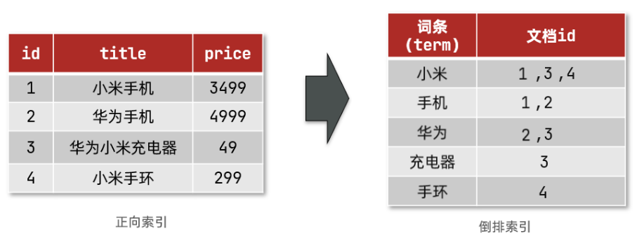
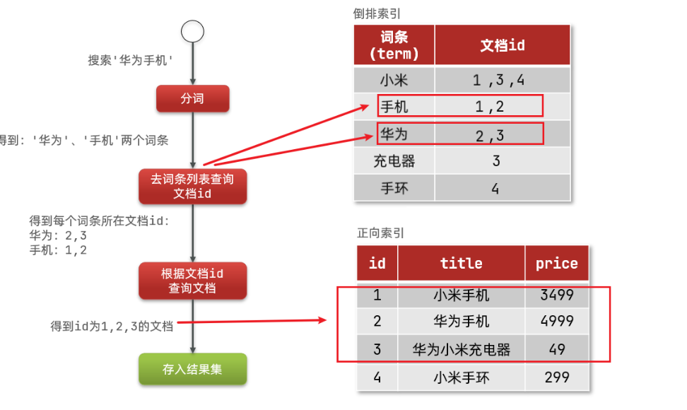
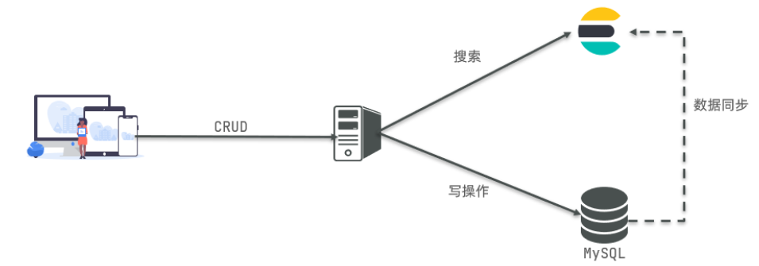

## 1：了解ES

> **什么是 `elasticsearch`？**  
> 一个开源的分布式搜索引擎，可以用来实现搜索、日志统计、分析、系统监控等功能

> **什么是 `elastic stack（ELK）`？**  
> 是以 `elasticsearch` 为核心的技术栈，包括 `beats`、`Logstash`、`kibana`、`elasticsearch`

> **什么是 `Lucene` ？**  
> 是 `Apache` 的开源搜索引擎类库，提供了搜索引擎的核心API

## 2：倒排索引

`倒排索引` 的概念是基于 `MySQL` 这样的 `正向索引` 而言的。

### 2.1 正向索引

如果是根据 `id` 查询，那么直接走 `索引`，查询速度非常快。

但如果是基于title做模糊查询，只能是逐行扫描数据，流程如下：

- 1）用户 `搜索数据` ，条件是title符合`"%手机%"`

- 2）逐行 `获取数据`，比如id为1的数据

- 3）判断数据中的 `title` 是否符合用户搜索条件

- 4）如果符合则放入结果集，不符合则丢弃。回到步骤1

`逐行扫描`，也就是 `全表扫描`，随着数据量增加，其查询效率也会越来越低。当数据量达到数百万时，就是一场灾难。

### 2.2 倒排索引

倒排索引中有两个非常重要的概念：

- 文档（`Document`）：用来搜索的数据，其中的每一条数据就是一个文档。例如一个网页、一个商品信息
- 词条（`Term`）：对文档数据或用户搜索数据，利用某种算法分词，得到的具备含义的词语就是词条。例如：我是中国人，就可以分为：我、是、中国人、中国、国人这样的几个词条

**创建倒排索引**是对正向索引的一种特殊处理，流程如下：

- 将每一个文档的数据利用算法分词，得到一个个词条
- 创建表，每行数据包括词条、词条所在文档id、位置等信息
- 因为词条唯一性，可以给词条创建索引，例如hash表结构索引

如图：

倒排索引的**搜索流程**如下（以搜索"华为手机"为例）：

- 1）用户输入条件`"华为手机"`进行搜索。

- 2）对用户输入内容**分词**，得到词条：`华为`、`手机`。

- 3）拿着词条在倒排索引中查找，可以得到包含词条的文档id：1、2、3。

- 4）拿着文档id到正向索引中查找具体文档。

如图：

虽然要先查询 `倒排索引`，再查询 `倒排索引`，但是无论是词条、还是文档id都建立了索引，查询速度非常快！无需全表扫描。

### 2.3 正向和倒排

> 那么为什么一个叫做正向索引，一个叫做倒排索引呢？

- **正向索引**是最传统的，根据id索引的方式。但根据词条查询时，必须先逐条获取每个文档，然后判断文档中是否包含所需要的词条，是**根据文档找词条的过程**。

- 而**倒排索引**则相反，是先找到用户要搜索的词条，根据词条得到保护词条的文档的id，然后根据id获取文档。是**根据词条找文档的过程**。

是不是恰好反过来了？

那么两者方式的优缺点是什么呢？

**正向索引**：

- 优点：
  - 可以给 `多个字段` 创建 `索引`
  - 根据 `索引字段` 搜索、排序速度非常快
- 缺点：
  - 根据 `非索引字段`，或者索引字段中的部分词条查找时，只能全表扫描。

**倒排索引**：

- 优点：
  - 根据 `词条搜索`、 `模糊搜索` 时，速度非常快
- 缺点：
  - 只能给词条创建索引，而不是字段
  - 无法根据字段做排序

## 3：es的一些概念

### 3.1 文档和字段

`elasticsearch` 是面向**文档（Document）**存储的，可以是数据库中的一条商品数据，一个订单信息。文档数据会被 `序列化为json格式` 后存储在 `elasticsearch` 中：

而Json文档中往往包含很多的**字段（Field）**，类似于数据库中的 `列` 。

### 3.2 索引和映射

**索引（Index）**，就是相同类型的文档的集合。

例如：

- 所有 `用户文档`，就可以组织在一起，称为 `用户`的 `索引`；
- 所有 `商品的文档`，可以组织在一起，称为 `商品` 的 `索引`；
- 所有 `订单的文档`，可以组织在一起，称为 `订单` 的 `索引`；

因此，我们可以把索引当做是数据库中的表。

数据库的表会有约束信息，用来定义表的结构、字段的名称、类型等信息。因此，索引库中就有**映射（mapping）**，是索引中文档的字段约束信息，类似表的结构约束。

### 3.3 mysql与elasticsearch

我们统一的把mysql与elasticsearch的概念做一下对比：

| **MySQL** | **Elasticsearch** | **说明**                                                                          |
| --------- | ----------------- | --------------------------------------------------------------------------------- |
| Table     | Index             | 索引(index)，就是文档的集合，类似数据库的表(table)                                |
| Row       | Document          | 文档（Document），就是一条条的数据，类似数据库中的行（Row），文档都是JSON格式     |
| Column    | Field             | 字段（Field），就是JSON文档中的字段，类似数据库中的列（Column）                   |
| Schema    | Mapping           | Mapping（映射）是索引中文档的约束，例如字段类型约束。类似数据库的表结构（Schema） |
| SQL       | DSL               | DSL是elasticsearch提供的JSON风格的请求语句，用来操作elasticsearch，实现CRUD       |

> 是不是说，我们学习了 `elasticsearch` 就不再需要 `mysql` 了呢？

并不是如此，两者各自有自己的擅长支出：

- `Mysql`：擅长事务类型操作，可以确保数据的安全和一致性

- `Elasticsearch`：擅长海量数据的搜索、分析、计算

因此在企业中，往往是两者结合使用：

- 对安全性要求较高的写操作，使用mysql实现
- 对查询性能要求较高的搜索需求，使用elasticsearch实现
- 两者再基于某种方式，实现数据的同步，保证一致性

## 4：安装es

### 4.1 参考地址

### 4.2 总结

>  **`分词器` 的作用是什么？**
> - 创建倒排索引时对文档分词  
> - 用户搜索时，对输入的内容分词  

>  **`IK分词器` 有几种模式？**  
> - `ik_smart` ：智能切分，粗粒度
> - `ik_max_word`：最细切分，细粒度

>  **`IK分词器` 如何拓展词条？如何停用词条？**    
> - 利用 `config` 目录的 `IkAnalyzer.cfg.xml` 文件添加拓展词典和停用词典
> - 在词典中添加拓展词条或者停用词条