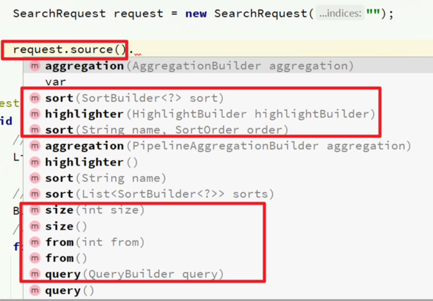
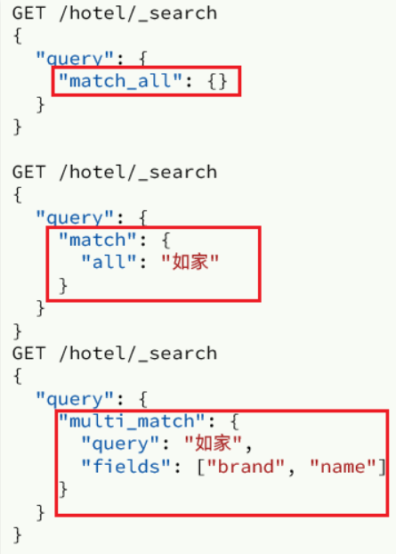
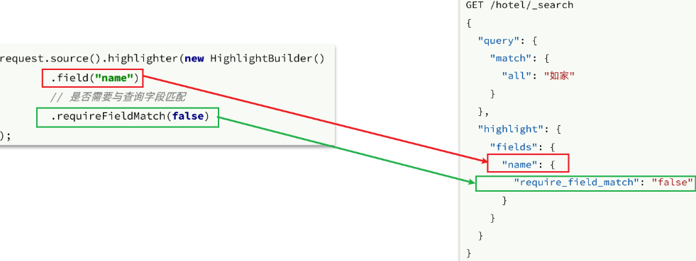
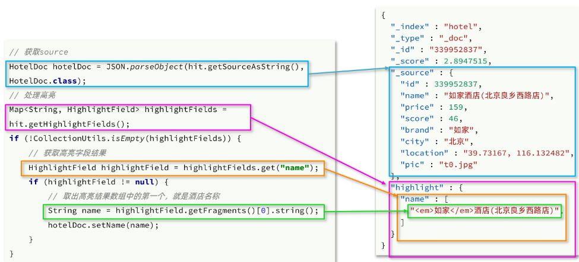

文档的查询 RestHighLevelClient对象，基本步骤包括：

- 1）准备Request对象
- 2）准备请求参数
- 3）发起请求
- 4）解析响应

## 1：快速入门

我们以 `match_all` 查询为例

### 1.1 发起查询请求


代码解读：

- 第一步，创建`SearchRequest`对象，指定索引库名

- 第二步，利用`request.source()`构建DSL，DSL中可以包含查询、分页、排序、高亮等
  - `query()`：代表查询条件，利用`QueryBuilders.matchAllQuery()`构建一个 `match_all` 查询的DSL
- 第三步，利用 `client.search()` 发送请求，得到响应

这里关键的API有两个，一个是`request.source()`，其中包含了查询、排序、分页、高亮等所有功能：



另一个是`QueryBuilders`，其中包含match、term、function_score、bool等各种查询：


### 1.2 解析响应

响应结果的解析


elasticsearch返回的结果是一个JSON字符串，结构包含：

- `hits`：命中的结果
  - `total`：总条数，其中的value是具体的总条数值
  - `max_score`：所有结果中得分最高的文档的相关性算分
  - `hits`：搜索结果的文档数组，其中的每个文档都是一个json对象
    - `_source`：文档中的原始数据，也是json对象

因此，我们解析响应结果，就是逐层解析JSON字符串，流程如下：

- `SearchHits`：通过response.getHits()获取，就是JSON中的最外层的hits，代表命中的结果
  - `SearchHits#getTotalHits().value`：获取总条数信息
  - `SearchHits#getHits()`：获取SearchHit数组，也就是文档数组
    - `SearchHit#getSourceAsString()`：获取文档结果中的_source，也就是原始的json文档数据


### 1.3 完整代码

```java
@Test
void testMatchAll() throws IOException {
    // 1.准备Request
    SearchRequest request = new SearchRequest("hotel");
    // 2.准备DSL
    request.source()
        .query(QueryBuilders.matchAllQuery());
    // 3.发送请求
    SearchResponse response = client.search(request, RequestOptions.DEFAULT);

    // 4.解析响应
    handleResponse(response);
}

private void handleResponse(SearchResponse response) {
    // 4.解析响应
    SearchHits searchHits = response.getHits();
    // 4.1.获取总条数
    long total = searchHits.getTotalHits().value;
    System.out.println("共搜索到" + total + "条数据");
    // 4.2.文档数组
    SearchHit[] hits = searchHits.getHits();
    // 4.3.遍历
    for (SearchHit hit : hits) {
        // 获取文档source
        String json = hit.getSourceAsString();
        // 反序列化
        HotelDoc hotelDoc = JSON.parseObject(json, HotelDoc.class);
        System.out.println("hotelDoc = " + hotelDoc);
    }
}
```

### 1.4 小结

查询的基本步骤是：

- 1. 创建 `SearchRequest` 对象
- 2. 准备 `Request.source()` ，也就是 `DSL`。
  - ① `QueryBuilders`来构建查询条件
  - ② 传入 `Request.source()` 的 `query()` 方法
- 3. 发送请求，得到结果
- 4. 解析结果（参考JSON结果，从外到内，逐层解析）

## 2：match查询

全文检索的 `match` 和 `multi_match查询` 与 `match_all` 的API基本一致。差别是查询条件，也就是 `query` 的部分。



因此，Java代码上的差异主要是 `request.source().query()` 中的参数了。同样是利用`QueryBuilders` 提供的方法：


而结果解析代码则完全一致，可以抽取并共享。

完整代码如下：

```java
@Test
void testMatch() throws IOException {
    // 1.准备Request
    SearchRequest request = new SearchRequest("hotel");
    // 2.准备DSL
    request.source()
        .query(QueryBuilders.matchQuery("all", "如家"));
    // 3.发送请求
    SearchResponse response = client.search(request, RequestOptions.DEFAULT);
    // 4.解析响应
    handleResponse(response);

}
```

## 3：精确查询

精确查询主要是两者：

- `term`：词条精确匹配
- `range`：范围查询

与之前的查询相比，差异同样在查询条件，其它都一样。

查询条件构造的API如下：


```java
    /*
     * term精确查询测试
     * */
    @Test
    void testMatchTerm() throws IOException {
        //1:准备request
        SearchRequest request = new SearchRequest("hotel");
        //2:组织DSL参数
        request.source()
                .query(QueryBuilders.termQuery("all","如家"));
        //3:发送请求，得到响应结果
        SearchResponse search = client.search(request, RequestOptions.DEFAULT);
        //4:输出响应结果
        handleResponse(search);
    }
```

## 4：布尔查询

布尔查询是用 `must`、`must_not`、`filter`等方式组合其它查询，代码示例如下：


可以看到，API与其它查询的差别同样是在查询条件的构建，QueryBuilders，结果解析等其他代码完全不变。

```java
@Test
void testBool() throws IOException {
    // 1.准备Request
    SearchRequest request = new SearchRequest("hotel");
    // 2.准备DSL
    // 2.1.准备BooleanQuery
    BoolQueryBuilder boolQuery = QueryBuilders.boolQuery();
    // 2.2.添加term
    boolQuery.must(QueryBuilders.termQuery("city", "杭州"));
    // 2.3.添加range
    boolQuery.filter(QueryBuilders.rangeQuery("price").lte(250));

    request.source().query(boolQuery);
    // 3.发送请求
    SearchResponse response = client.search(request, RequestOptions.DEFAULT);
    // 4.解析响应
    handleResponse(response);

}
```

## 5：排序、分页

搜索结果的排序和分页是与query同级的参数，因此同样是使用 `request.source()`来设置。

对应的API如下：


```java
@Test
void testPageAndSort() throws IOException {
    // 页码，每页大小
    int page = 1, size = 5;

    // 1.准备Request
    SearchRequest request = new SearchRequest("hotel");
    // 2.准备DSL
    // 2.1.query
    request.source().query(QueryBuilders.matchAllQuery());
    // 2.2.排序 sort
    request.source().sort("price", SortOrder.ASC);
    // 2.3.分页 from、size
    request.source().from((page - 1) * size).size(5);
    // 3.发送请求
    SearchResponse response = client.search(request, RequestOptions.DEFAULT);
    // 4.解析响应
    handleResponse(response);

}
```

## 6：高亮

高亮的代码与之前代码差异较大，有两点：

- `查询的DSL`：其中除了查询条件，还需要添加高亮条件，同样是与query同级。
- `结果解析`：结果除了要解析_source文档数据，还要解析高亮结果

### 6.1 高亮请求构建

高亮请求的构建API如下：



上述代码省略了查询条件部分，但是大家不要忘了：**高亮查询必须使用全文检索查询，并且要有搜索关键字，将来才可以对关键字高亮。**


```java
@Test
void testHighlight() throws IOException {
    // 1.准备Request
    SearchRequest request = new SearchRequest("hotel");
    // 2.准备DSL
    // 2.1.query
    request.source().query(QueryBuilders.matchQuery("all", "如家"));
    // 2.2.高亮
    request.source().highlighter(new HighlightBuilder().field("name").requireFieldMatch(false));
    // 3.发送请求
    SearchResponse response = client.search(request, RequestOptions.DEFAULT);
    // 4.解析响应
    handleResponse(response);

}
```

### 6.2 高亮结果解析

高亮的结果与查询的文档结果默认是分离的，并不在一起。

因此解析高亮的代码需要额外处理：



代码解读：

- **第一步**：从结果中获取 `source`。`hit.getSourceAsString()`，这部分是非高亮结果，`json字符串`。**还需要反序列为 `HotelDoc` 对象**
- **第二步**：获取高亮结果。`hit.getHighlightFields()`，返回值是一个 `Map`，`key` 是高亮字段名称，值是 `HighlightField` 对象，代表高亮值
- **第三步**：从map中根据高亮字段名称，获取高亮字段值对象 `HighlightField`
- **第四步**：从 `HighlightField` 中获取 `Fragments`，并且转为字符串。这部分就是真正的高亮字符串了
- **第五步**：用高亮的结果替换 `HotelDoc`中的非高亮结果

完整代码：

```java
private void handleResponse(SearchResponse response) {
    // 4.解析响应
    SearchHits searchHits = response.getHits();
    // 4.1.获取总条数
    long total = searchHits.getTotalHits().value;
    System.out.println("共搜索到" + total + "条数据");
    // 4.2.文档数组
    SearchHit[] hits = searchHits.getHits();
    // 4.3.遍历
    for (SearchHit hit : hits) {
        // 获取文档source
        String json = hit.getSourceAsString();
        // 反序列化
        HotelDoc hotelDoc = JSON.parseObject(json, HotelDoc.class);
        // 获取高亮结果
        Map<String, HighlightField> highlightFields = hit.getHighlightFields();
        if (!CollectionUtils.isEmpty(highlightFields)) {
            // 根据字段名获取高亮结果
            HighlightField highlightField = highlightFields.get("name");
            if (highlightField != null) {
                // 获取高亮值
                String name = highlightField.getFragments()[0].string();
                // 覆盖非高亮结果
                hotelDoc.setName(name);
            }
        }
        System.out.println("hotelDoc = " + hotelDoc);
    }
}
```