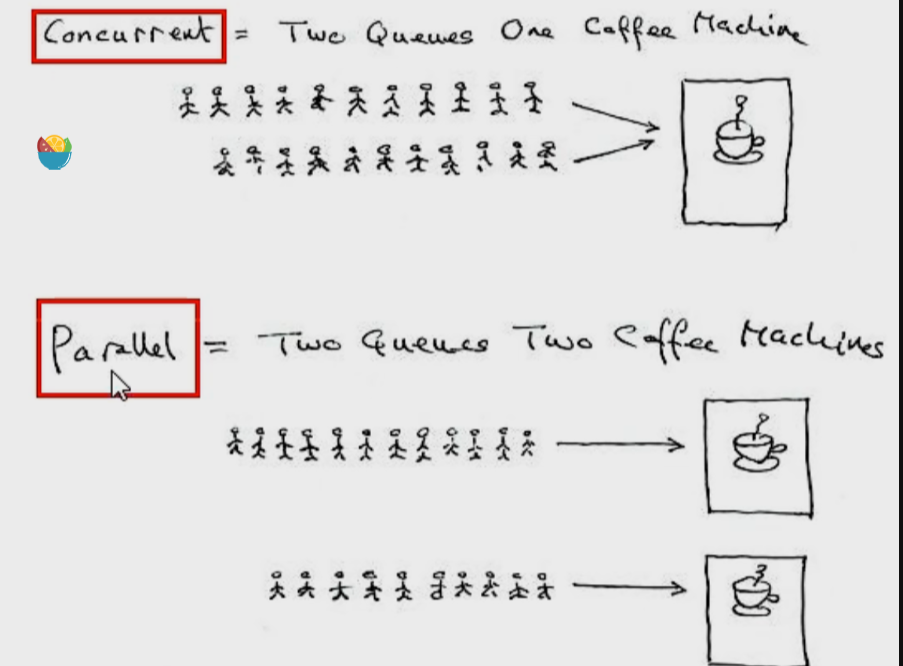

## 1：start线程解读
```java
public static void main(String[] args) {
        Thread t1 = new Thread(() ->{
        },"t1");
        t1.start();
    }
```
```java
//start
    public synchronized void start() {
        /**
         * This method is not invoked for the main method thread or "system"
         * group threads created/set up by the VM. Any new functionality added
         * to this method in the future may have to also be added to the VM.
         *
         * A zero status value corresponds to state "NEW".
         */
        if (threadStatus != 0)
            throw new IllegalThreadStateException();

        /* Notify the group that this thread is about to be started
         * so that it can be added to the group's list of threads
         * and the group's unstarted count can be decremented. */
        group.add(this);

        boolean started = false;
        try {
            start0();
            started = true;
        } finally {
            try {
                if (!started) {
                    group.threadStartFailed(this);
                }
            } catch (Throwable ignore) {
                /* do nothing. If start0 threw a Throwable then
                  it will be passed up the call stack */
            }
        }
    }
```
```java
private native void start0();//start0是一个native方法
```
`native`调用了本地方法，我们可以通过下载官网OpenJDK查看其源码
## 2：Java多线程相关概念
### 1）1把锁
### 2）2个并（并发和并行）
- ①并发：是在`同一实体上的多个事件`，是在同一台处理器上“同时”处理多个任务，同一时刻，其实是只有`一个事件`在发生。

- ②并行：是在`不同实体上的多个事件`，是在多台处理器上同时处理多个任务，同一时刻，大家`都真的在做事情`，你做你的，我做我的
- 并发 vs 并行

### 3）3个程（进程 线程 管程）
通过上面start线程的案例，其实进程线程都来源于操作系统。
- ①进程：系统中运行的一个`应用程序`就是`一个进程`，每一个`进程`都有它自己的`内存空间`和`系统资源`。

- ②线程：也被称为`轻量级进程`，在同一个进程内基本会有`1一个或多个线程`，是大多数操作系统进行调度的`基本单元`。

- ③管程：`Monitor（监视器）`，也就是我们平时说的`锁 ` 

Monitor其实是一种`同步机制`，他的义务是保证（同一时间）只有一个线程可以访问被保护的数据和代码。

JVM中同步是基于进入和退出`监视器对象(Monitor,管程对象)`来实现的，每个对象实例都会有一个Monitor对象，

Monitor对象会和Java对象一同`创建`并`销毁`，它底层是由C++语言来实现的。

- 进程VS线程  
进程是…，线程是…，`进程`和`线程`的最大不同在于`进程`基本上是独立的，而`线程`不一定，`线程`共享`方法区`和`堆`，`线程`私有`栈`、`本地方法栈`和`程序计数器`

## 3：用户线程和守护线程
Java线程分为`用户线程`和`守护线程`
- 线程的`daemon`属性为  
  - `true`表示是`守护线程`
  - `false`表示是`用户线程`
### 1）用户线程

是系统的工作线程，它会完成这个程序需要完成的业务操作

### 2）守护线程
是一种特殊的线程，为其他线程服务的，在后台默默地完成一些系统性的服务，比如垃圾回收线程。

### 3）总结
```java
public class DaemonDemo
{
public static void main(String[] args)
{
    Thread t1 = new Thread(() -> {
        System.out.println(Thread.currentThread().getName()+"\t 开始运行，"+(Thread.currentThread().isDaemon() ? "守护线程":"用户线程"));
        while (true) {

        }
    }, "t1");
    //线程的daemon属性为true表示是守护线程，false表示是用户线程
    //---------------------------------------------
    t1.setDaemon(true);
    //-----------------------------------------------
    t1.start();
    //3秒钟后主线程再运行
    try { TimeUnit.SECONDS.sleep(3); } catch (InterruptedException e) { e.printStackTrace(); }

    System.out.println("----------main线程运行完毕");
}

}
```
- 两种情况
  - 未加`t1.setDaemon(true);`，默认是用户线程，他会继续运行，所以灯亮着
  - 加了`t1.setDaemon(true);`是守护线程，当用户线程main方法结束后自动退出了
- 守护线程作为一个`服务线程`，没有服务对象就没有必要继续运行了，如果用户线程全部结束了，意味着程序需要完成的业务操作已经结束了，系统可退出了。假如当系统只剩下守护线程的时候，java虚拟机会自动退出。

- `setDaemon(true)`方法必须在`start()`之前设置，否则报`IIIegalThreadStateException`异常
