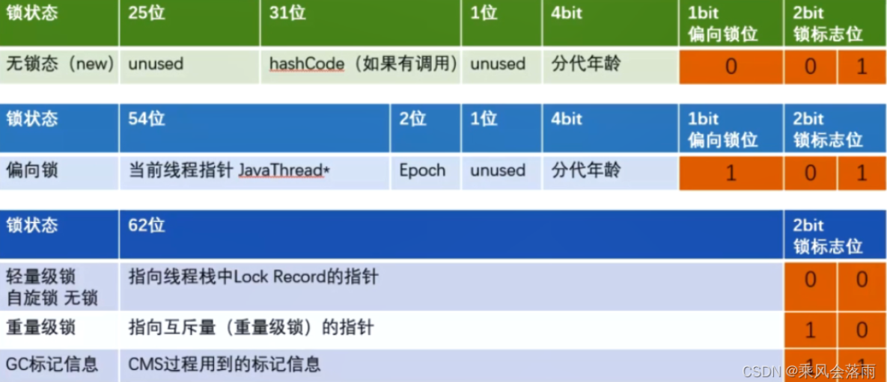
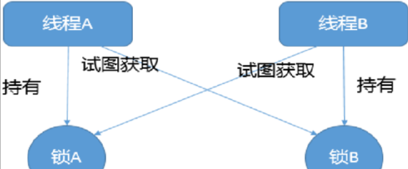
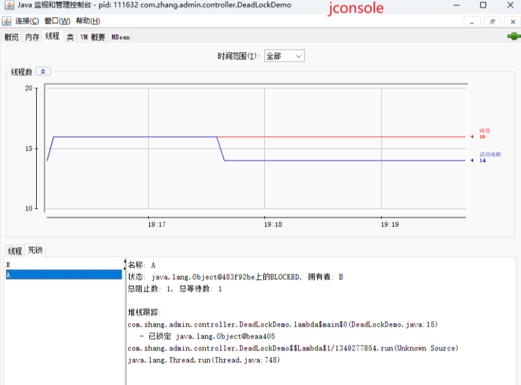
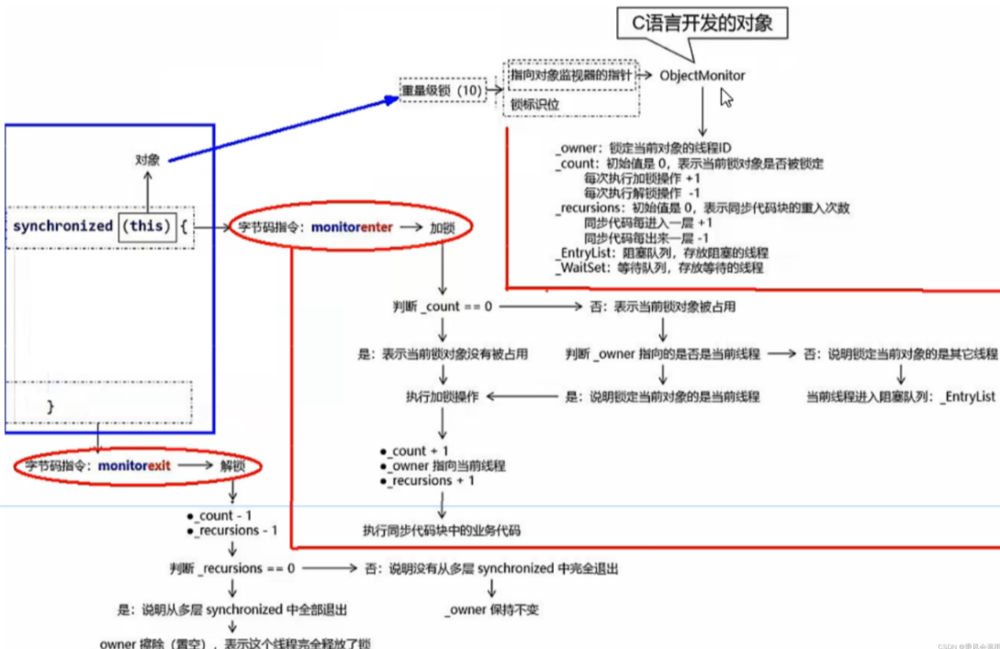

## 1：大厂面试题
- 一、`Synchronized`相关问题
  - 1.`Synchronized`用过吗， 其原理是什么?
  - 2.你刚才提到获取对象的锁，这个锁到底是什么?如何确定对象的锁?
  - 3.什么是可重入性，为什么说`Synchronized`是可重入锁?
  - 4.JVM对Java的原生锁做了哪些优化?
  - 5.为什么说`Synchronized`是非公平锁?
  - 6.什么是锁消除和锁粗化?
  - 7.为什么说`Synchronized`是个悲观锁?乐观锁的实现原理又是什么?什么是`CAS`， 它有
  - 8.乐观锁一定就是好的吗?
- 二、可重入锁`ReentrantLock`及其他显式锁相关问题
  - 1.跟`Synchronized`相比，可重入锁`ReentrantLock`其实现原理有什么不同?
  - 2.那么请谈谈`AQS`框架是怎么回事儿?
  - 3.请尽可能详尽地对比下`Synchronized`和`ReentrantLock`的异同。
  - 4.`ReentrantLock`是如何实现可重入性的?
- 三：
  - 1，你怎么理解iava多线程的?怎么处理并发?线程池有那几个核心参数?
  - 2，Java加锁有哪几种锁?我先说了`synchronized`， 刚讲到偏向锁， 他就不让我讲了，
  - 3，简单说说lock?
  - 4，`hashmap`的实现原理?hash冲突怎么解决?为什么使用红黑树?
  - 5，spring里面都使用了那些设计模式?循环依赖怎么解决?
  - 6，项目中那个地方用了`countdownlanch`， 怎么使用的?
## 2：乐观锁和悲观锁

### 1）悲观锁
- **悲观锁**认为自己在使用数据的时候一定有别的线程来**修改数据**，因此在获取数据的时候会**先加锁**，确保数据不会被别的线程修改。
- 悲观锁的实现方式
  - `synchronized`关键字
  - `Lock`的实现类都是悲观锁
- 适合**写操作多**的场景，先加锁可以保证写操作时数据正确。显示的锁定之后再操作同步资源。
```java
//=============悲观锁的调用方式
public synchronized void m1()
{
    //加锁后的业务逻辑......
}

// 保证多个线程使用的是同一个lock对象的前提下
ReentrantLock lock = new ReentrantLock();
public void m2() {
    lock.lock();
    try {
        // 操作同步资源
    }finally {
        lock.unlock();
    }
}
```
### 2）乐观锁
- **乐观锁**认为自己在使用数据时不会有别的线程修改数据，所以不会添加锁，只是在更新数据的时候去判断之前有没有别的线程更新了这个数据。如果这个数据没有**被更新**，当前线程将自己修改的数据成功写入。如果数据已经被其他线程更新，则根据不同的实现方式执行不同的操作
- **乐观锁**的实现方式
  - 1.版本号机制Version。（**只要有人提交了就会修改版本号，可以解决ABA问题**）
    - **ABA问题**：再CAS中想读取一个值A，想把值A变为C，不能保证读取时的A就是赋值时的A，中间可能有个线程将A变为B再变为A。
      - **解决方法**：Juc包提供了一个`AtomicStampedReference`，原子更新带有版本号的引用类型，通过控制版本值的变化来解决ABA问题。
  - 2.最常采用的是**CAS算法**，Java原子类中的递增操作就通过**CAS自旋**实现的。
- 适合读操作多的场景，不加锁的性能特点能够使其操作的性能大幅提升。
```java
//=============乐观锁的调用方式
// 保证多个线程使用的是同一个AtomicInteger
private AtomicInteger atomicInteger = new AtomicInteger();
atomicInteger.incrementAndGet();
```
## 3：从8种情况演示锁的案例，看看我们到底锁的是什么

### 1）8锁案例
- 阿里巴巴代码规范
  - 【强制】高并发时，同步调用应该去考量锁的性能损耗。能用**无锁数据结构**，就不要用**锁**；能**锁区块**，就**不要锁整个方法体**；能用**对象锁**，就**不要用类锁**。
  - 说明：尽可能使加锁的代码块工作量尽可能的小，避免在锁代码块中调用 RPC 方法。
#### 8锁演示
- 8锁案例
```java
class Phone{
    public static synchronized void sendEmail(){
        try {TimeUnit.SECONDS.sleep(3);} catch (InterruptedException e) {e.printStackTrace();}
        System.out.println("-------------sendEmail");

    }
    public  synchronized void sendSMS(){//static
        System.out.println("-------------sendSMS");
    }
    public void hello(){
        System.out.println("-------------hello");
    }
}

/**
 * - 题目：谈谈你对多线程锁的理解，8锁案例说明
 * - 口诀：线程 操作 资源类
 * 1. 标准访问有ab两个线程，请问先打印邮件还是短信?邮件
 * 2. a里面故意停3秒？邮件
 * 3. 添加一个普通的hello方法，请问先打印邮件还是hello？hello
 * 4. 有两部手机，请问先打印邮件（这里有个3秒延迟）还是短信?短信
 * 5.有两个静态同步方法（synchroized前加static,3秒延迟也在），有1部手机，先打印邮件还是短信？邮件
 * 6.两个手机，有两个静态同步方法（synchroized前加static,3秒延迟也在），有1部手机，先打印邮件还是短信？邮件
 * 7.一个静态同步方法，一个普通同步方法，请问先打印邮件还是手机？短信
 * 8.两个手机，一个静态同步方法，一个普通同步方法，请问先打印邮件还是手机？短信
 */
public class lock8 {
    public static void main(String[] args) {
        Phone phone = new Phone();
        Phone phone2 = new Phone();
        new Thread(()->{
            phone.sendEmail();
        },"a").start();

        //暂停毫秒，保证a线程先启动
        try {TimeUnit.MILLISECONDS.sleep(200);} catch (InterruptedException e) {e.printStackTrace();}

        new Thread(()->{
            phone.sendSMS();
        },"b").start();
    }
}
```
#### 8锁原理
- 1.2中
  - 一个对象里面如果有多个**synchronized**方法，某一时刻内，只要一个线程去调用其中的一个**synchronized**方法了，**其他的线程都只能是等待**，换句话说，**某一个时刻内，只能有唯一的一个线程去访问这些synchronized方法，锁的是当前对象this**，被锁定后，其它的线程都不能 进入到当前对象的其他**synchronized**方法
- 3中
  - **hello并未和其他synchronized修饰的方法产生争抢**
- 4 中
  - 锁在两个不同的对象/两个不同的资源上，不产生竞争条件
- 5.6中static+synchronized - 类锁 `phone = new Phone()`;中 加到了左边的Phone上
  - 对于**普通同步方法**，锁的是**当前实例对象**，**通常指this**，具体的一部部手机，所有的普通同步方法用的都是同一把锁→实例对象本身。
  - 对于**静态同步方法**，锁的是**当前类的Class对象**，如Phone，class唯一的一个模板。
  - 对于**同步方法块**，锁的是**synchronized括号内的对象**。synchronized(o)
- 7.8中
  - 一个加了对象锁，一个加了类锁，不产生竞争条件

#### 8锁-3个体现
- 8种锁的案例实际体现在3个地方-相当于总结
  - 作用域**实例方法**，**当前实例加锁，进入同步代码块前要获得当前实例的锁**。
  - 作用于**代码块**，**对括号里配置的对象加锁**。
  - 作用于**静态方法**，**当前类加锁，进去同步代码前要获得当前类对象的锁**。
### 2）字节码角度分析synchronized实现
#### 文件反编译技巧
- 文件反编译`javap -c ***.class`文件反编译，-c表示对代码进行反汇编
- 假如需要更多信息 `javap -v ***.class` ，-v即-verbose输出附加信息（包括行号、本地变量表、反汇编等详细信息）
#### synchronized同步代码块
```java
/**
 * 锁同步代码块
 */
public class LockSyncDemo {
    Object object = new Object();

    public void m1(){
        synchronized (object){
            System.out.println("-----hello synchronized code block");
        }
    }

    public static void main(String[] args) {

    }
}
```
从target中找到`LockSyncDemo.class文`件，右键，`open in terminal`，然后`javap -c LockSyncDemo.class`
```java
public class com.zhang.admin.controller.LockSyncDemo {
  java.lang.Object object;

  public com.zhang.admin.controller.LockSyncDemo();
    Code:
       0: aload_0
       1: invokespecial #1                  // Method java/lang/Object."<init>":()V
       4: aload_0
       5: new           #2                  // class java/lang/Object
       8: dup
       9: invokespecial #1                  // Method java/lang/Object."<init>":()V
      12: putfield      #3                  // Field object:Ljava/lang/Object;
      15: return

  public void m1();
    Code:
       0: aload_0
       1: getfield      #3                  // Field object:Ljava/lang/Object;
       4: dup
       5: astore_1
       6: monitorenter        //**注****------进入锁
       7: getstatic     #4                  // Field java/lang/System.out:Ljava/io/PrintStream;
      10: ldc           #5                  // String -----hello synchronized code block
      12: invokevirtual #6                  // Method java/io/PrintStream.println:(Ljava/lang/String;)V
      15: aload_1
      16: monitorexit        // **注**------退出锁
      17: goto          25
      20: astore_2
      21: aload_1
      22: monitorexit        //**注**-----这里又有一个exit???????以防出现异常，保证能够释放锁
      23: aload_2
      24: athrow
      25: return
    Exception table:
       from    to  target type
           7    17    20   any
          20    23    20   any

  public static void main(java.lang.String[]);
    Code:
       0: return
}

```
- 总结
  - synchronized同步代码块，实现使用的是moniterenter和moniterexit指令（moniterexit可能有两个）
  - 那一定是一个enter两个exit吗？（不一样，如果主动throw一个RuntimeException，发现一个enter，一个exit，还有两个athrow）

#### synchronized普通同步方法
```java
/**
 * 锁普通的同步方法
 */
public class LockSyncDemo {

    public synchronized void m2(){
        System.out.println("------hello synchronized m2");
    }

    public static void main(String[] args) {

    }
}
```
类似于上述操作，最后调用`javap -v LockSyncDemo.class`
```java
.....
public synchronized void m2();
    descriptor: ()V
    flags: ACC_PUBLIC, ACC_SYNCHRONIZED //请注意该标志
    Code:
      stack=2, locals=1, args_size=1
         0: getstatic     #2                  // Field java/lang/System.out:Ljava/io/PrintStream;
         3: ldc           #3                  // String ------hello synchronized m2
         5: invokevirtual #4                  // Method java/io/PrintStream.println:(Ljava/lang/String;)V
         8: return
      LineNumberTable:
        line 11: 0
        line 12: 8
      LocalVariableTable:
        Start  Length  Slot  Name   Signature
            0       9     0  this   Lcom/zhang/admin/controller/LockSyncDemo;
......
```
- 总结
  - 调用指令将会检查方法的****访问标志是否被设置。如果设置了，执行线程会将先持有monitore然后再执行方法，最后在方法完成（无论是正常完成还是非正常完成）时释放monitor
#### synchronized静态同步方法
```java
/**
 * 锁静态同步方法
 */
public class LockSyncDemo {

    public synchronized void m2(){
        System.out.println("------hello synchronized m2");
    }

    public static synchronized void m3(){
        System.out.println("------hello synchronized m3---static");
    }


    public static void main(String[] args) {

    }
}

```
和上面一样的操作
```java
 ......
 public static synchronized void m3();
    descriptor: ()V
    flags: ACC_PUBLIC, ACC_STATIC, ACC_SYNCHRONIZED //访问标志 区分该方法是否是静态同步方法
    Code:
      stack=2, locals=0, args_size=0
         0: getstatic     #2                  // Field java/lang/System.out:Ljava/io/PrintStream;
         3: ldc           #5                  // String ------hello synchronized m3---static
         5: invokevirtual #4                  // Method java/io/PrintStream.println:(Ljava/lang/String;)V
         8: return
      LineNumberTable:
        line 15: 0
        line 16: 8
......
```
- 总结
  - ******, ******访问标志区分该方法是否是静态同步方法。
### 3）反编译synchronized锁的是什么
#### 管程概念
- 管程：Monitor（监视器），也就是我们平时说的锁。监视器锁
- 信号量及其操作原语“封装”在一个对象内部）管程实现了在一个时间点，最多只有一个线程在执行管程的某个子程序。 管程提供了一种机制，管程可以看做一个软件模块，它是将共享的变量和对于这些共享变量的操作封装起来，形成一个具有一定接口的功能模块，进程可以调用管程来实现进程级别的并发控制。
- 执行线程就要求先成功持有管程，然后才能执行方法，最后当方法完成（无论是正常完成还是非正常完成）时释放管理。在方法执行期间，执行线程持有了管程，其他任何线程都无法再获取到同一个管程。

#### 大厂：为什么任何一个对象都可以成为一个锁？
- 溯源
  - `Java Object `类是所有类的父类，也就是说 Java 的所有类都继承了 `Object`，子类可以使用 `Object` 的所有方法。
  - `ObjectMonitor.java→ObjectMonitor.cpp→objectMonitor.hpp`

`ObjectMonitor.cpp`中引入了头文件（`include）objectMonitor.hpp`

```java
140行
  ObjectMonitor() {
    _header       = NULL;
    _count        = 0; //用来记录该线程获取锁的次数
    _waiters      = 0,
    _recursions   = 0;//锁的重入次数
    _object       = NULL;
    _owner        = NULL; //------最重要的----指向持有ObjectMonitor对象的线程，记录哪个线程持有了我
    _WaitSet      = NULL; //存放处于wait状态的线程队列
    _WaitSetLock  = 0 ;
    _Responsible  = NULL ;
    _succ         = NULL ;
    _cxq          = NULL ;
    FreeNext      = NULL ;
    _EntryList    = NULL ;//存放处于等待锁block状态的线程队列
    _SpinFreq     = 0 ;
    _SpinClock    = 0 ;
    OwnerIsThread = 0 ;
    _previous_owner_tid = 0;
  }

```
- 追溯底层可以发现每个对象天生都带着一个**对象监视器**。

### 4）提前熟悉锁升级
`synchronized`必须作用于某个对象中，所以Java在对象的头文件存储了锁的相关信息。锁升级功能主要依赖于 MarkWord 中的锁标志位和释放偏向锁标志位  

## 4：公平锁和非公平锁
### 1）ReentrantLock抢票案例
```java
class Ticket
{
    private int number = 30;
    ReentrantLock lock = new ReentrantLock();
    //ReentrantLock lock = new ReentrantLock(true);

    public void sale()
    {
        lock.lock();
        try
        {
            if(number > 0)
            {
                System.out.println(Thread.currentThread().getName()+"卖出第：\t"+(number--)+"\t 还剩下:"+number);
            }
        }catch (Exception e){
            e.printStackTrace();
        }finally {
            lock.unlock();
        }
    }
}


/**
 * @auther zzyy
 * @create 2020-05-14 17:26
 */
public class SaleTicketDemo
{
    public static void main(String[] args)
    {
        Ticket ticket = new Ticket();

        new Thread(() -> { for (int i = 0; i <35; i++)  ticket.sale(); },"a").start();
        new Thread(() -> { for (int i = 0; i <35; i++)  ticket.sale(); },"b").start();
        new Thread(() -> { for (int i = 0; i <35; i++)  ticket.sale(); },"c").start();
    }
}
```
#### 非公平锁
- 默认是非公平锁
- 非公平锁可以**插队**，买卖票不均匀。
- 是指多个线程获取锁的顺序并不是按照申请锁的顺序，有可能后申请的线程比先申请的线程优先获取锁，在高并发环境下，有可能造成优先级翻转或**饥饿的状态**（某个线程一直得不到锁）
#### 公平锁
- `ReentrantLock lock = new ReentrantLock(true);`
- 买卖票一开始a占优，后面a b c a b c a b c均匀分布
- 是指多个线程按照**申请锁的顺序来获取锁**，这里类似排队买票，先来的人先买后来的人在队尾排着，这是公平的。
#### 为什么会有公平锁/非公平锁的设计？为什么默认是非公平？
- 1:**恢复挂起的线程到真正锁的获取还是有时间差的**，从开发人员来看这个时间微乎其微，但是从CPU的角度来看，这个时间差存在的还是很明显的。**所以非公平锁能更充分的利用CPU 的时间片**，尽量减少 CPU 空闲状态时间。

- 2:使用多线程很重要的考量点是**线程切换的开销**，当采用非公平锁时，当1个线程请求锁获取同步状态，然后释放同步状态，因为不需要考虑是否还有前驱节点，所以刚释放锁的线程在此刻再次获取同步状态的概率就变得非常大，所以就减少了线程的开销。

#### 什么时候用公平？什么时候用非公平？
如果为了更高的**吞吐量**，很显然非公平锁是比较合适的，因为**节省很多线程切换时间**，吞吐量自然就上去了；
否则那就用公平锁，大家公平使用。
#### AQS提前了解

## 5：可重入锁（又名递归锁）

### 1）可重入锁说明
可重入锁又名递归锁

是指在同一个线程在**外层方法**获取锁的时候，再进入该线程的**内层方法**会**自动获取锁**(前提，锁对象得是同一个对象)，不会因为之前已经获取过还没释放而阻塞。

如果是1个有 synchronized 修饰的递归调用方法，程序第2次进入被自己阻塞了岂不是天大的笑话，出现了作茧自缚。

所以Java中**ReentrantLock和synchronized都是可重入锁**，可重入锁的一个优点是可一定程度**避免死锁**。

### 2）“可重入锁”详细解释
- 可：可以
- 重：再次
- 入：进入
- 锁：同步锁
- 进入什么：进入同步域（即同步代码块/方法或显示锁锁定的代码）
- 一句话：一个线程中的多个流程可以获取同一把锁，持有这把锁可以再次进入。自己可以获取自己的内部锁。
### 3）可重入锁种类
#### 隐式锁Synchronized
- `synchronized`是java中的关键字，默认是`可重入锁`，即隐式锁
  - 在同步块中
```java
public class ReEntryLockDemo {
    public static void main(String[] args)
    {
        final Object objectLockA = new Object();

        new Thread(() -> {
            synchronized (objectLockA)
            {
                System.out.println("-----外层调用");
                synchronized (objectLockA)
                {
                    System.out.println("-----中层调用");
                    synchronized (objectLockA)
                    {
                        System.out.println("-----内层调用");
                    }
                }
            }
        },"a").start();
    }
}
//-----外层调用
//-----中层调用
//-----内层调用
```
  - 在同步方法中

```java
public class ReEntryLockDemo
{
    public synchronized void m1()
    {
        //指的是可重复可递归调用的锁，在外层使用之后，在内层仍然可以使用，并且不发生死锁，这样的锁就叫做可重入锁
        System.out.println(Thread.currentThread().getName()+"\t"+"-----come in m1");
        m2();
        System.out.println(Thread.currentThread().getName()+"\t-----end m1");
    }
    public synchronized void m2()
    {
        System.out.println("-----m2");
        m3();
    }
    public synchronized void m3()
    {
        System.out.println("-----m3");
    }

    public static void main(String[] args)
    {
        ReEntryLockDemo reEntryLockDemo = new ReEntryLockDemo();

        reEntryLockDemo.m1();
    }
}
/**
 * main  -----come in m1
 * -----m2
 * -----m3
 * main  -----end m1
 */
```

**Synchronized的重入实现机理**
- 回看上方的`ObjectMoitor.hpp`
```java
140行
  ObjectMonitor() {
    _header       = NULL;
    _count        = 0; //用来记录该线程获取锁的次数
    _waiters      = 0,
    _recursions   = 0;//锁的重入次数
    _object       = NULL;
    _owner        = NULL; //------最重要的----指向持有ObjectMonitor对象的线程，记录哪个线程持有了我
    _WaitSet      = NULL; //存放处于wait状态的线程队列
    _WaitSetLock  = 0 ;
    _Responsible  = NULL ;
    _succ         = NULL ;
    _cxq          = NULL ;
    FreeNext      = NULL ;
    _EntryList    = NULL ;//存放处于等待锁block状态的线程队列
    _SpinFreq     = 0 ;
    _SpinClock    = 0 ;
    OwnerIsThread = 0 ;
    _previous_owner_tid = 0;
  }

```
- `ObjectMoitor.hpp`**底层**：每个锁对象拥有一个**锁计数器**和**一个指向持有该锁的线程**的指针。`_count _owner`

- **首次加锁**：当执行`monitorenter`时，如果目标锁对象的**计数器**为零，那么说明它没有被其他线程所持有，Java虚拟机会将**该锁对象的持有线程**设置为**当前线程**，并且将其**计数器**加1。

- **重入**：在目标锁对象的**计数器**不为零的情况下，如果**锁对象的持有线程**是**当前线程**，那么 Java 虚拟机可以将其**计数器**加1，否则需要等待，直至持有线程释放该锁。

- **释放锁**：当执行`monitorexit`时，Java虚拟机则需将锁对象的**计数器**减1。计数器为零代表锁已被释放。

#### 显式锁Lock
- 显式锁（即Lock）也有`ReentrantLock`这样的可重入锁
> 感觉所谓的显式隐式即是指显示/隐式的调用锁
- 注意：`lock` `unlock`要成对

```java
public class ReEntryLockDemo {
    static Lock lock = new ReentrantLock();
    public static void main(String[] args) {

        {
            new Thread(() -> {
                lock.lock();
                try {
                    System.out.println(Thread.currentThread().getName() + "\t----come in 外层调用");
                    lock.lock();
                    try {
                        System.out.println(Thread.currentThread().getName() + "\t------come in 内层调用");
                    } finally {
                        lock.unlock();
                    }
                } finally {
                    lock.unlock();
                }
            }, "t1").start();
        }
    }
}
//t1  ----come in 外层调用
//t1  ------come in 内层调用
```
- 假如`lock` `unlock`不成对，单线程情况下问题不大，但多线程下出问题
```java
public class ReEntryLockDemo {
    static Lock lock = new ReentrantLock();
    public static void main(String[] args) {

            new Thread(() -> {
                lock.lock();
                try {
                    System.out.println(Thread.currentThread().getName() + "\t----come in 外层调用");
                    lock.lock();
                    try {
                        System.out.println(Thread.currentThread().getName() + "\t------come in 内层调用");
                    } finally {
                        lock.unlock();
                    }
                } finally {
                    //lock.unlock();//-------------------------不成对|多线程情况
                }
            }, "t1").start();

        new Thread(() -> {
            lock.lock();
            try
            {
                System.out.println("t2 ----外层调用lock");
            }finally {
                lock.unlock();
            }
        },"t2").start();

    }
}
//t1  ----come in 外层调用
//t1  ------come in 内层调用
//(t2 ----外层调用lock 假如不成对，这句话就不显示了)
```


## 6：死锁及排查
### 1）死锁是什么
- 死锁
  - 是指两个或两个以上的线程在执行过程中,因争夺资源而造成的一种互相等待的现象,若无外力干涉那它们都将无法推进下去，如果系统资源充足，进程的资源请求都能够得到满足，死锁出现的可能性就很低，否则就会因争夺有限的资源而陷入死锁。
  - a跟b两个资源互相请求对方的资源
- 死锁产生的原因
  - 系统资源不足
  - 进程运行推进的顺序不合适
  - 资源分配不当

### 2）请写一个死锁代码case
```java
public class DeadLockDemo {
    public static void main(String[] args) {
        Object object1 = new Object();
        Object object2 = new Object();

        new Thread(()->{
            synchronized (object1){
                System.out.println(Thread.currentThread().getName()+"\t 持有a锁，想获得b锁");
                try {TimeUnit.SECONDS.sleep(1);} catch (InterruptedException e) {e.printStackTrace();}//使得线程b也启动
                synchronized (object2){
                    System.out.println(Thread.currentThread().getName()+"\t 成功获得b锁");
                }
            }
        },"A").start();

        new Thread(()->{
            synchronized (object2){
                System.out.println(Thread.currentThread().getName()+"\t 持有b锁，想获得a锁");
                synchronized (object1){
                    System.out.println(Thread.currentThread().getName()+"\t 成功获得a锁");
                }
            }
        },"B").start();
    }

}
```
### 3）如何排查死锁
#### 纯命令
- `jps -l` 查看当前进程运行状况
- `jstack 进程编号` 查看该进程信息


#### 图形化
- `win + r` 输入`jconsole` ，打开图形化工具，打开`线程` ，点击 `检测死锁`。

## 7：小总结-重要
- 指针指向`monitor对象`（也称为管程或监视器锁）的起始地址。每个对象都存在着一个`monitor`与之关联，当一个`monitor`被某个`线程持有`后，它便处于`锁定状态`。在Java虚拟机(HotSpot)中，`monitor`是由`ObjectMonitor`实现的，其主要数据结构如下（位于HotSpot虚拟机源码ObjectMonitor.hpp,C++实现的）

## 8：以下相当于一些前置知识，为后面的章节做铺垫
- 写锁（独占锁）/读锁（共享锁）
- 自旋锁SpinLock
- 无锁-独占锁-读写锁-邮戳锁
- 无锁-偏向锁-轻量锁-重量锁


