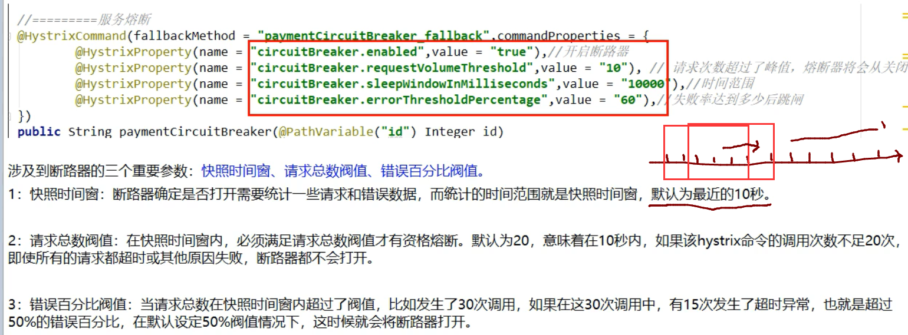
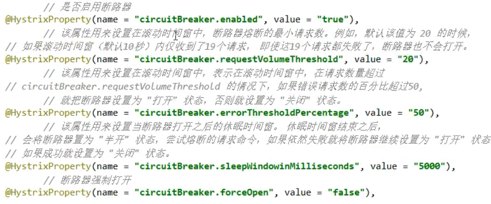
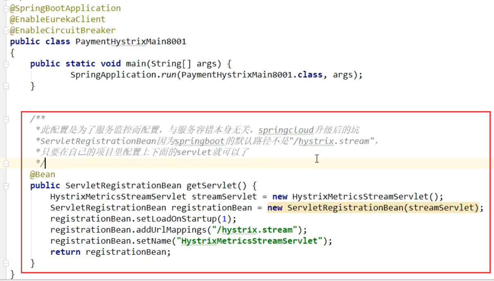
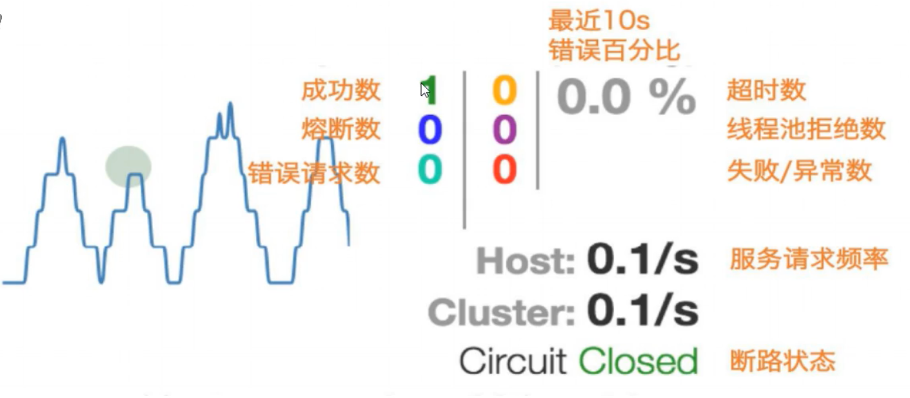

## 1：hystrix中的重要概念

### 服务降级

**比如当某个服务繁忙,不能让客户端的请求一直等待,应该立刻返回给客户端一个备选方案**

### 服务熔断

- **当某个服务出现问题,卡死了,不能让用户一直等待,需要关闭所有对此服务的访问**
- **然后调用服务降级**

### 服务限流

**限流,比如秒杀场景,不能访问用户瞬间都访问服务器,限制一次只可以有多少请求**

## 2：原子服务服务降级、熔断（提供者）
### 1）pom.xml
```xml
<?xml version="1.0" encoding="UTF-8"?>
<project xmlns="http://maven.apache.org/POM/4.0.0"
         xmlns:xsi="http://www.w3.org/2001/XMLSchema-instance"
         xsi:schemaLocation="http://maven.apache.org/POM/4.0.0 http://maven.apache.org/xsd/maven-4.0.0.xsd">
    <parent>
        <artifactId>cloud2020</artifactId>
        <groupId>com.atguigu.springcloud</groupId>
        <version>1.0-SNAPSHOT</version>
    </parent>
    <modelVersion>4.0.0</modelVersion>

    <artifactId>cloud-provider-hystrix-payment8001</artifactId>


    <dependencies>
        <!--新增hystrix-->
        <dependency>
            <groupId>org.springframework.cloud</groupId>
            <artifactId>spring-cloud-starter-netflix-hystrix</artifactId>
        </dependency>


        <dependency>
            <groupId>org.springframework.cloud</groupId>
            <artifactId>spring-cloud-starter-netflix-eureka-client</artifactId>
        </dependency>

        <dependency>
            <groupId>com.atguigu.springcloud</groupId>
            <artifactId>cloud-api-commons</artifactId>
            <version>${project.version}</version>
        </dependency>


        <dependency>
            <groupId>org.springframework.boot</groupId>
            <artifactId>spring-boot-starter-web</artifactId>
        </dependency>

        <dependency>
            <groupId>org.springframework.boot</groupId>
            <artifactId>spring-boot-starter-actuator</artifactId>
        </dependency>

        <!--        <dependency>-->
        <!--            <groupId>org.springframework.boot</groupId>-->
        <!--            <artifactId>spring-boot-devtools</artifactId>-->
        <!--            <scope>runtime</scope>-->
        <!--            <optional>true</optional>-->
        <!--        </dependency>-->

        <dependency>
            <groupId>org.projectlombok</groupId>
            <artifactId>lombok</artifactId>
            <optional>true</optional>
        </dependency>
        <dependency>
            <groupId>org.springframework.boot</groupId>
            <artifactId>spring-boot-starter-test</artifactId>
            <scope>test</scope>
        </dependency>
    </dependencies>

</project>
```
### 2）application.yml
```yml
server:
  port: 8001

spring:
  application:
    name: cloud-provider-hystrix-payment

eureka:
  client:
    register-with-eureka: true
    fetch-registry: true
    service-url:
      #defaultZone: http://eureka7001.com:7001/eureka,http://eureka7002.com:7002/eureka
      defaultZone: http://eureka7001.com:7001/eureka
```

### 3）启动类
```java
@SpringBootApplication
@EnableEurekaClient
//注解开启断路器功能
@EnableCircuitBreaker
public class CloudProviderHystrixPayment8001Application {
    public static void main(String[] args) {
        SpringApplication.run(CloudProviderHystrixPayment8001Application.class, args);
        System.out.println("启动成功");
    }


    /**
     * 注意：新版本Hystrix需要在主启动类中指定监控路径
     * 此配置是为了服务监控而配置，与服务容错本身无关，spring cloud升级后的坑
     * ServletRegistrationBean因为springboot的默认路径不是"/hystrix.stream"，
     * 只要在自己的项目里配置上下面的servlet就可以了
     *
     * @return ServletRegistrationBean
     */
    @Bean
    public ServletRegistrationBean getServlet() {
        HystrixMetricsStreamServlet streamServlet = new HystrixMetricsStreamServlet();
        ServletRegistrationBean registrationBean = new ServletRegistrationBean(streamServlet);

        // 一启动就加载
        registrationBean.setLoadOnStartup(1);
        // 添加url
        registrationBean.addUrlMappings("/hystrix.stream");
        // 设置名称
        registrationBean.setName("HystrixMetricsStreamServlet");
        return registrationBean;
    }

}
```
### 4）service
```java
@Service
public class PaymentService {
    /**
     * 正常访问，肯定OK
     *
     * @param id
     * @return
     */
    public String paymentInfoOK(Integer id) {
        return "线程池:  " + Thread.currentThread().getName() + "  paymentInfoOK,id:  " + id + "\t"
                + "O(∩_∩)O哈哈~";
    }


    /**
     * 超时访问，设置自身调用超时的峰值，峰值内正常运行，超过了峰值需要服务降级 自动调用fallbackMethod 指定的方法
     * 超时异常或者运行异常 都会进行服务降级
     *
     * @param id
     * @return
     */
    @HystrixCommand(fallbackMethod = "paymentInfoTimeOutHandler", commandProperties = {
            @HystrixProperty(name = "execution.isolation.thread.timeoutInMilliseconds", value = "5000")
    })
    public String paymentInfoTimeOut(Integer id) {
//        int age = 10/0;
        int second = 3;
        long start = System.currentTimeMillis();
        try {
            TimeUnit.SECONDS.sleep(second);
        } catch (InterruptedException e) {
            e.printStackTrace();
        }
        long end = System.currentTimeMillis();
        System.out.println(end - start);
        return "线程池:  " + Thread.currentThread().getName() + " paymentInfoTimeOut,id:  " + id + "\t"
                + "O(∩_∩)O哈哈~" + "  耗时(秒): " + second;
    }


    /**
     * paymentInfoTimeOut 方法失败后 自动调用此方法 实现服务降级 告知调用者 paymentInfoTimeOut 目前无法正常调用
     *
     * @param id
     * @return
     */
    public String paymentInfoTimeOutHandler(Integer id) {
        return "线程池:  " + Thread.currentThread().getName() + "  paymentInfoTimeOutHandler8001系统繁忙或者运行报错，请稍后再试,id:  " + id + "\t"
                + "o(╥﹏╥)o";
    }


    /**
     * 服务熔断 超时、异常、都会触发熔断
     * 1、默认是最近10秒内收到不小于10个请求，<br/>
     * 2、并且有60%是失败的<br/>
     * 3、就开启断路器<br/>
     * 4、开启后所有请求不再转发，降级逻辑自动切换为主逻辑，减小调用方的响应时间<br/>
     * 5、经过一段时间（时间窗口期，默认是5秒），断路器变为半开状态，会让其中一个请求进行转发。<br/>
     * &nbsp;&nbsp;5.1、如果成功，断路器会关闭，<br/>
     * &nbsp;&nbsp;5.2、若失败，继续开启。重复4和5<br/>
     *
     * @param id
     * @return
     */
    @HystrixCommand(fallbackMethod = "paymentCircuitBreakerFallback", commandProperties = {
            @HystrixProperty(name = "circuitBreaker.enabled", value = "true"),/* 是否开启断路器*/
            @HystrixProperty(name = "circuitBreaker.requestVolumeThreshold", value = "10"),// 请求次数
            @HystrixProperty(name = "circuitBreaker.sleepWindowInMilliseconds", value = "10000"), // 时间窗口期
            @HystrixProperty(name = "circuitBreaker.errorThresholdPercentage", value = "60"),// 失败率达到多少后跳闸
//            @HystrixProperty(name = "execution.isolation.thread.timeoutInMilliseconds", value = "5000")// 超时处理
    })
    public String paymentCircuitBreaker(Integer id) {
        if (id < 0) {
            throw new RuntimeException("******id 不能负数");
        }
        //测试异常
//        int age = 10 / 0;
//        int second = 3;
//        try {
//            TimeUnit.SECONDS.sleep(second);
//        } catch (InterruptedException e) {
//            e.printStackTrace();
//        }


        String serialNumber = IdUtil.simpleUUID();
        return Thread.currentThread().getName() + "\t" + "调用成功，流水号: " + serialNumber;
    }


    /**
     * paymentCircuitBreaker 方法的 fallback，<br/>
     * 当断路器开启时，主逻辑熔断降级，该 fallback 方法就会替换原 paymentCircuitBreaker 方法，处理请求
     *
     * @param id
     * @return
     */
    public String paymentCircuitBreakerFallback(Integer id) {
        return Thread.currentThread().getName() + "\t" + "id 不能负数或超时或自身错误，请稍后再试，/(ㄒoㄒ)/~~   id: " + id;
    }

}
```

### 5：controller
```java
@RestController
@RequestMapping("payment")
@Slf4j
public class PaymentController {
    /**
     * 服务对象
     */
    @Resource
    private PaymentService paymentService;

    @Value("${server.port}")
    private String serverPort;


    /**
     * 正常访问
     *
     * @param id
     * @return
     */
    @GetMapping("/hystrix/ok/{id}")
    public String paymentInfoOK(@PathVariable("id") Integer id) {
        String result = paymentService.paymentInfoOK(id);
        log.info("result: " + result);
        return result;
    }


    /**
     * 超时或者异常
     *
     * @param id
     * @return
     */
    @GetMapping("/hystrix/timeout/{id}")
    public String paymentInfoTimeOut(@PathVariable("id") Integer id) {
        String result = paymentService.paymentInfoTimeOut(id);
        log.info("result: " + result);
        return result;
    }


    /**
     * 服务熔断
     *
     * @param id
     * @return
     */
    @GetMapping("/circuit/{id}")
    public String paymentCircuitBreaker(@PathVariable("id") Integer id) {
        String result = paymentService.paymentCircuitBreaker(id);
        log.info("****result: " + result);
        return result;
    }
}
```


**解决:**


## 3：编排服务服务降级、熔断（消费者）

一共有三种实现方法
- 全局熔断
- 单个方法熔断
- 远程接口写实现类
### 1）pom.xml
```xml
<?xml version="1.0" encoding="UTF-8"?>
<project xmlns="http://maven.apache.org/POM/4.0.0"
         xmlns:xsi="http://www.w3.org/2001/XMLSchema-instance"
         xsi:schemaLocation="http://maven.apache.org/POM/4.0.0 http://maven.apache.org/xsd/maven-4.0.0.xsd">
    <parent>
        <artifactId>cloud2020</artifactId>
        <groupId>com.atguigu.springcloud</groupId>
        <version>1.0-SNAPSHOT</version>
    </parent>
    <modelVersion>4.0.0</modelVersion>

    <artifactId>cloud-consumer-feign-hystrix-order80</artifactId>

    <dependencies>
        <!--新增hystrix-->
        <dependency>
            <groupId>org.springframework.cloud</groupId>
            <artifactId>spring-cloud-starter-netflix-hystrix</artifactId>
        </dependency>
        <dependency>
            <groupId>org.springframework.cloud</groupId>
            <artifactId>spring-cloud-starter-openfeign</artifactId>
        </dependency>
        <dependency>
            <groupId>org.springframework.cloud</groupId>
            <artifactId>spring-cloud-starter-netflix-eureka-client</artifactId>
        </dependency>
        <dependency>
            <groupId>com.atguigu.springcloud</groupId>
            <artifactId>cloud-api-commons</artifactId>
            <version>${project.version}</version>
        </dependency>
        <dependency>
            <groupId>org.springframework.boot</groupId>
            <artifactId>spring-boot-starter-web</artifactId>
        </dependency>

        <dependency>
            <groupId>org.springframework.boot</groupId>
            <artifactId>spring-boot-starter-actuator</artifactId>
        </dependency>

        <!--        <dependency>-->
        <!--            <groupId>org.springframework.boot</groupId>-->
        <!--            <artifactId>spring-boot-devtools</artifactId>-->
        <!--            <scope>runtime</scope>-->
        <!--            <optional>true</optional>-->
        <!--        </dependency>-->

        <dependency>
            <groupId>org.projectlombok</groupId>
            <artifactId>lombok</artifactId>
            <optional>true</optional>
        </dependency>
        <dependency>
            <groupId>org.springframework.boot</groupId>
            <artifactId>spring-boot-starter-test</artifactId>
            <scope>test</scope>
        </dependency>
    </dependencies>


</project>
```
### 2）application.yml
```yml
server:
  port: 80

eureka:
  client:
    register-with-eureka: false
    service-url:
      defaultZone: http://eureka7001.com:7001/eureka/

feign:
  hystrix:
    enabled: true #如果处理自身的容错就开启。开启方式与生产端不一样。
```


### 3）主启动类
```java
@SpringBootApplication
@EnableFeignClients // 启动 feign
@EnableHystrix // 启动 hystrix
public class CloudConsumerFeignHystrixOrder80Application {

    public static void main(String[] args) {
        SpringApplication.run(CloudConsumerFeignHystrixOrder80Application.class, args);
        System.out.println("启动成功");

    }

}
```
### 4）service
```java
@Component
// FeignFallback 客户端的服务降级 针对 CLOUD-PROVIDER-HYSTRIX-PAYMENT 该服务 提供了一个 对应的服务降级类
@FeignClient(value = "CLOUD-PROVIDER-HYSTRIX-PAYMENT", fallback = PaymentFallbackServiceImpl.class)
//@FeignClient(value = "CLOUD-PROVIDER-HYSTRIX-PAYMENT")
public interface PaymentHystrixService {
    @GetMapping("/payment/hystrix/ok/{id}")
    String paymentInfoOK(@PathVariable("id") Integer id);

    @GetMapping("/payment/hystrix/timeout/{id}")
    String paymentInfoTimeOut(@PathVariable("id") Integer id);
}
```
### 5）serviceImpl
```java
@Component
public class PaymentFallbackServiceImpl implements PaymentHystrixService {

    @Override
    public String paymentInfoOK(Integer id) {
        return "-----PaymentFallbackService fall back-paymentInfo_OK ,o(╥﹏╥)o";
    }

    @Override
    public String paymentInfoTimeOut(Integer id) {
        return "-----PaymentFallbackService fall back-paymentInfo_TimeOut ,o(╥﹏╥)o";
    }

}
```
### 6）controller
```java
@RestController
@RequestMapping("consumer")
@Slf4j
@DefaultProperties(defaultFallback = "payment_Global_FallbackMethod")// hystrix 全局fallback方法

public class OrderHystrixController {
    @Resource
    private PaymentHystrixService paymentHystrixService;

    @GetMapping("/payment/hystrix/ok/{id}")
    public String paymentInfoOK(@PathVariable("id") Integer id) {
        String result = paymentHystrixService.paymentInfoOK(id);
        return result;
    }


    @GetMapping("/payment/hystrix/timeout/{id}")
//    @HystrixCommand(fallbackMethod = "paymentTimeOutFallbackMethod", commandProperties = {
//            @HystrixProperty(name = "execution.isolation.thread.timeoutInMilliseconds", value = "5000")
//    })
    @HystrixCommand
    public String paymentInfoTimeOut(@PathVariable("id") Integer id) {
        int age = 10 / 0;
        String result = paymentHystrixService.paymentInfoTimeOut(id);
        return result;
    }

    /**
     * 超时访问，设置自身调用超时的峰值，峰值内正常运行，超过了峰值需要服务降级 自动调用fallbackMethod 指定的方法
     * <br/>
     * 超时异常或者运行异常 都会进行服务降级
     *
     * @param id
     * @return
     */
    public String paymentTimeOutFallbackMethod(@PathVariable("id") Integer id) {
        return "我是消费者80,对方支付系统繁忙请10秒钟后再试或者自己运行出错请检查自己,o(╥﹏╥)o";
    }

    /**
     * hystrix 全局fallback方法
     *
     * @return
     */
    public String payment_Global_FallbackMethod() {
        return "Global异常处理信息，请稍后再试，/(ㄒoㄒ)/~~";
    }

}
```

## 4：Hystrix所有可配置的属性

**全部在这个方法中记录,以成员变量的形式记录,**

 以后需要什么属性,查看这个类即可


## 5: 总结


**==当断路器开启后:==**


**==其他参数:==**





**==熔断整体流程:==**
> 1请求进来,首先查询缓存,如果缓存有,直接返回
        如果缓存没有,--->2
        2,查看断路器是否开启,如果开启的,Hystrix直接将请求转发到降级返回,然后返回
        如果断路器是关闭的,
        判断线程池等资源是否已经满了,如果已经满了
        也会走降级方法
        如果资源没有满,判断我们使用的什么类型的Hystrix,决定调用构造方法还是run方法
        然后处理请求
        然后Hystrix将本次请求的结果信息汇报给断路器,因为断路器此时可能是开启的
        (因为断路器开启也是可以接收请求的)
        断路器收到信息,判断是否符合开启或关闭断路器的条件,
        如果本次请求处理失败,又会进入降级方法
        如果处理成功,判断处理是否超时,如果超时了,也进入降级方法
        最后,没有超时,则本次请求处理成功,将结果返回给controller


## 6：Hystrix服务监控

> HystrixDashboard


> 2,使用HystrixDashboard:

### 1,创建项目:

名字: cloud_hystrixdashboard_9001

### 2,pom文件
```xml
<?xml version="1.0" encoding="UTF-8"?>
<project xmlns="http://maven.apache.org/POM/4.0.0"
         xmlns:xsi="http://www.w3.org/2001/XMLSchema-instance"
         xsi:schemaLocation="http://maven.apache.org/POM/4.0.0 http://maven.apache.org/xsd/maven-4.0.0.xsd">
    <parent>
        <artifactId>cloud2020</artifactId>
        <groupId>com.atguigu.springcloud</groupId>
        <version>1.0-SNAPSHOT</version>
    </parent>
    <modelVersion>4.0.0</modelVersion>

    <artifactId>cloud-consumer-hystrix-dashboard9001</artifactId>


    <dependencies>
        <!--新增hystrix dashboard-->
        <dependency>
            <groupId>org.springframework.cloud</groupId>
            <artifactId>spring-cloud-starter-netflix-hystrix-dashboard</artifactId>
        </dependency>
        <dependency>
            <groupId>org.springframework.boot</groupId>
            <artifactId>spring-boot-starter-actuator</artifactId>
        </dependency>

        <!--        <dependency>-->
        <!--            <groupId>org.springframework.boot</groupId>-->
        <!--            <artifactId>spring-boot-devtools</artifactId>-->
        <!--            <scope>runtime</scope>-->
        <!--            <optional>true</optional>-->
        <!--        </dependency>-->

        <dependency>
            <groupId>org.projectlombok</groupId>
            <artifactId>lombok</artifactId>
            <optional>true</optional>
        </dependency>
        <dependency>
            <groupId>org.springframework.boot</groupId>
            <artifactId>spring-boot-starter-test</artifactId>
            <scope>test</scope>
        </dependency>
    </dependencies>

</project>
```
### 3,配置文件
```yml
server:
  port: 9001
```

### 4,主启动类


```java
@SpringBootApplication
@EnableHystrixDashboard
public class CloudConsumerHystrixDashboard9001Application {

    public static void main(String[] args) {
        SpringApplication.run(CloudConsumerHystrixDashboard9001Application.class, args);
        System.out.println("启动成功");

    }

}
```
### 5,修改所有pay模块(8001,8002,8003...)

**他们都添加一个pom依赖:**


之前的pom文件中都添加过了,==这个是springboot的监控组件==

### 6,启动9001即可

 访问: **localhost:9001/hystrix**

### 7,注意,此时仅仅是可以访问HystrixDashboard,并不代表已经监控了8001,8002

 如果要监控,还需要配置:(8001为例)

==8001的主启动类添加:==



**其他8002,8003都是一样的**

```java
    /**
     * 注意：新版本Hystrix需要在主启动类中指定监控路径
     * 此配置是为了服务监控而配置，与服务容错本身无关，spring cloud升级后的坑
     * ServletRegistrationBean因为springboot的默认路径不是"/hystrix.stream"，
     * 只要在自己的项目里配置上下面的servlet就可以了
     *
     * @return ServletRegistrationBean
     */
    @Bean
    public ServletRegistrationBean getServlet() {
        HystrixMetricsStreamServlet streamServlet = new HystrixMetricsStreamServlet();
        ServletRegistrationBean registrationBean = new ServletRegistrationBean(streamServlet);

        // 一启动就加载
        registrationBean.setLoadOnStartup(1);
        // 添加url
        registrationBean.addUrlMappings("/hystrix.stream");
        // 设置名称
        registrationBean.setName("HystrixMetricsStreamServlet");
        return registrationBean;
    }


```

### 8,到此,可以启动服务

启动7001,8001,9001

**然后在web界面,指定9001要监控8001:**





