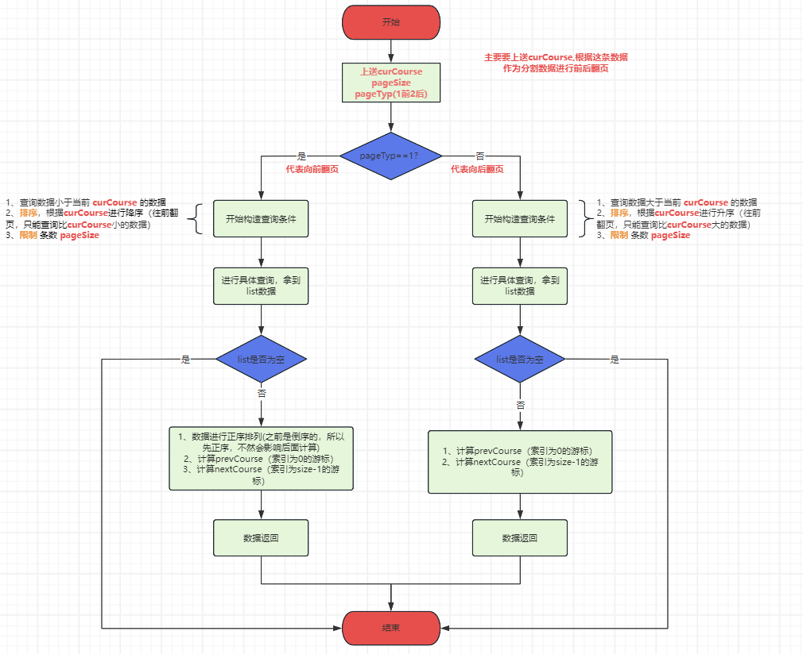

## 1：什么是深翻页？

> 深翻页（Deep Pagination）通常指的是在Web应用或数据检索系统中，用户需要浏览到数据集合中非常靠后的页面时，系统需要支持翻越大量页面以到达目标位置的操作。在大型数据集的情况下，这通常涉及到查询数据库中远离起始位置的记录。随着翻页深度的增加（即用户浏览到更后面的页面），查询性能可能会急剧下降，因为数据库需要花费更多的时间和资源来检索和返回结果。

## 2：游标解决深翻页问题

> 就是客户端要上送一个 **标识（游标，也就是userId）**，然后后端就可以根据这个 **游标** 来作为查询条件进行数据查询。当前 需要上送的参数有 **三** 个
> - **游标** ，也就是 **数据标识，要根据哪一条数据进行翻页**？
> - **分页数量**
> - **`向前` 还是`向后` 翻页标识**


## 3：思路代码实现

### 3.1 思路



### 3.2 入参

```java
@Data
public class UserPageInput {
    private Integer pageSize; //代表分页数量
    private Integer curCursor; // 代表游标（向后翻页，则上送最后一个游标id(userId),向前翻页，上送索引为0的游标id(userId)）
    private String pageTyp; // 代表分页类型（1前，2后）
}
```

### 3.3 具体实现

```java
    @ApiOperation(value = "用户信息分页列表->解决深分页问题")
    @PostMapping("/getAllUserByDepthPage")
    public R getAllUserByDepthPage(@RequestBody UserPageInput userPageInput) {

        Integer prevCursor = null;
        Integer nextCursor = null;
        LambdaQueryWrapper<User> queryWrapper = new LambdaQueryWrapper<>();
        // 1. 封装查询条件
        //判断究竟是 向前翻页（1） 还是 向后翻页（2）
        if ("1".equals(userPageInput.getPageTyp())) { // 代表向前翻页
            queryWrapper.lt(User::getUserId, userPageInput.getCurCursor()) // 找到比当前id 小的
                    .orderByDesc(User::getUserId)  // 降序
                    .last("limit " + userPageInput.getPageSize()); //拿到当前条数
        } else { // 代表向后翻页
            queryWrapper.gt(User::getUserId, userPageInput.getCurCursor()) // 找到比当前id 大的
                    .orderByAsc(User::getUserId)  // 升序
                    .last("limit " + userPageInput.getPageSize()); //拿到当前条数
        }

        // 2.进行查询,获取结果
        List<User> users = userService.getBaseMapper().selectList(queryWrapper);

        // 3.返回 前一个游标 和 后一个游标
        if (CollectionUtils.isNotEmpty(users)) {
            // 根据userId进行升序排序（后翻页不影响，前翻页会受到印象-数据是降序，导致后面取得时候会大小混乱）
            if ("1".equals(userPageInput.getPageTyp())) { // 前翻页需要重排序
                users = users.stream().
                        sorted(Comparator.comparing(User::getUserId)).collect(Collectors.toList());
            }
            // 返回 前游标 和 后游标
            prevCursor = users.get(0).getUserId();
            nextCursor = users.get(users.size() - 1).getUserId();
        }
        return R.ok().data("result", users).data("prevCursor", prevCursor).data("nextCursor", nextCursor);
    }
```

