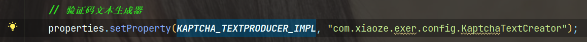

## 1：需要用到的包

```xml

    <kaptcha.version>2.3.3</kaptcha.version>

    <!-- 验证码 -->
    <dependency>
        <groupId>pro.fessional</groupId>
        <artifactId>kaptcha</artifactId>
        <version>${kaptcha.version}</version>
    </dependency>
```

## 2：后端代码实现

### 2.1 配置验证码格式yml

主要有 **数值型** 和 **字符型**

```yml
# 图形验证码方式
code:
  # 验证码类型 math 数字计算 char 字符验证
  captchaType: char
```

### 2.2 读取配置

```java
package com.xiaoze.exer.config;

import org.springframework.boot.context.properties.ConfigurationProperties;
import org.springframework.stereotype.Component;

@Component
@ConfigurationProperties(prefix = "code")
public class CodeConfig
{
    /** 验证码类型 */
    private static String captchaType;

    public static String getCaptchaType() {
        return captchaType;
    }

    public void setCaptchaType(String captchaType) {
        CodeConfig.captchaType = captchaType;
    }

}
```
### 2.3 验证码文本生成器

```java
package com.xiaoze.exer.config;

import com.google.code.kaptcha.text.impl.DefaultTextCreator;

import java.util.Random;

/**
 * 验证码文本生成器
 */
public class KaptchaTextCreator extends DefaultTextCreator
{
    private static final String[] CNUMBERS = "0,1,2,3,4,5,6,7,8,9,10".split(",");

    @Override
    public String getText()
    {
        Integer result = 0;
        Random random = new Random();
        int x = random.nextInt(10);
        int y = random.nextInt(10);
        StringBuilder suChinese = new StringBuilder();
        int randomoperands = random.nextInt(3);
        if (randomoperands == 0)
        {
            result = x * y;
            suChinese.append(CNUMBERS[x]);
            suChinese.append("*");
            suChinese.append(CNUMBERS[y]);
        }
        else if (randomoperands == 1)
        {
            if ((x != 0) && y % x == 0)
            {
                result = y / x;
                suChinese.append(CNUMBERS[y]);
                suChinese.append("/");
                suChinese.append(CNUMBERS[x]);
            }
            else
            {
                result = x + y;
                suChinese.append(CNUMBERS[x]);
                suChinese.append("+");
                suChinese.append(CNUMBERS[y]);
            }
        }
        else
        {
            if (x >= y)
            {
                result = x - y;
                suChinese.append(CNUMBERS[x]);
                suChinese.append("-");
                suChinese.append(CNUMBERS[y]);
            }
            else
            {
                result = y - x;
                suChinese.append(CNUMBERS[y]);
                suChinese.append("-");
                suChinese.append(CNUMBERS[x]);
            }
        }
        suChinese.append("=?@" + result);
        return suChinese.toString();
    }
}
```

### 2.4 设置生成的图片格式

```java
package com.xiaoze.exer.config;

import com.google.code.kaptcha.impl.DefaultKaptcha;
import com.google.code.kaptcha.util.Config;
import org.springframework.context.annotation.Bean;
import org.springframework.context.annotation.Configuration;

import java.util.Properties;

import static com.google.code.kaptcha.Constants.*;

@Configuration
public class CaptchaConfig
{
    @Bean(name = "captchaProducer")
    public DefaultKaptcha getKaptchaBean()
    {
        DefaultKaptcha defaultKaptcha = new DefaultKaptcha();
        Properties properties = new Properties();
        // 是否有边框 默认为true 我们可以自己设置yes，no
        properties.setProperty(KAPTCHA_BORDER, "yes");
        // 验证码文本字符颜色 默认为Color.BLACK
        properties.setProperty(KAPTCHA_TEXTPRODUCER_FONT_COLOR, "black");
        // 验证码图片宽度 默认为200
        properties.setProperty(KAPTCHA_IMAGE_WIDTH, "160");
        // 验证码图片高度 默认为50
        properties.setProperty(KAPTCHA_IMAGE_HEIGHT, "60");
        // 验证码文本字符大小 默认为40
        properties.setProperty(KAPTCHA_TEXTPRODUCER_FONT_SIZE, "38");
        // KAPTCHA_SESSION_KEY
        properties.setProperty(KAPTCHA_SESSION_CONFIG_KEY, "kaptchaCode");
        // 验证码文本字符长度 默认为5
        properties.setProperty(KAPTCHA_TEXTPRODUCER_CHAR_LENGTH, "4");
        // 验证码文本字体样式 默认为new Font("Arial", 1, fontSize), new Font("Courier", 1, fontSize)
        properties.setProperty(KAPTCHA_TEXTPRODUCER_FONT_NAMES, "Arial,Courier");
        // 图片样式 水纹com.google.code.kaptcha.impl.WaterRipple 鱼眼com.google.code.kaptcha.impl.FishEyeGimpy 阴影com.google.code.kaptcha.impl.ShadowGimpy
        properties.setProperty(KAPTCHA_OBSCURIFICATOR_IMPL, "com.google.code.kaptcha.impl.ShadowGimpy");
        Config config = new Config(properties);
        defaultKaptcha.setConfig(config);
        return defaultKaptcha;
    }

    @Bean(name = "captchaProducerMath")
    public DefaultKaptcha getKaptchaBeanMath()
    {
        DefaultKaptcha defaultKaptcha = new DefaultKaptcha();
        Properties properties = new Properties();
        // 是否有边框 默认为true 我们可以自己设置yes，no
        properties.setProperty(KAPTCHA_BORDER, "yes");
        // 边框颜色 默认为Color.BLACK
        properties.setProperty(KAPTCHA_BORDER_COLOR, "105,179,90");
        // 验证码文本字符颜色 默认为Color.BLACK
        properties.setProperty(KAPTCHA_TEXTPRODUCER_FONT_COLOR, "blue");
        // 验证码图片宽度 默认为200
        properties.setProperty(KAPTCHA_IMAGE_WIDTH, "160");
        // 验证码图片高度 默认为50
        properties.setProperty(KAPTCHA_IMAGE_HEIGHT, "60");
        // 验证码文本字符大小 默认为40
        properties.setProperty(KAPTCHA_TEXTPRODUCER_FONT_SIZE, "35");
        // KAPTCHA_SESSION_KEY
        properties.setProperty(KAPTCHA_SESSION_CONFIG_KEY, "kaptchaCodeMath");
        // 验证码文本生成器
        properties.setProperty(KAPTCHA_TEXTPRODUCER_IMPL, "com.xiaoze.exer.config.KaptchaTextCreator");
        // 验证码文本字符间距 默认为2
        properties.setProperty(KAPTCHA_TEXTPRODUCER_CHAR_SPACE, "3");
        // 验证码文本字符长度 默认为5
        properties.setProperty(KAPTCHA_TEXTPRODUCER_CHAR_LENGTH, "6");
        // 验证码文本字体样式 默认为new Font("Arial", 1, fontSize), new Font("Courier", 1, fontSize)
        properties.setProperty(KAPTCHA_TEXTPRODUCER_FONT_NAMES, "Arial,Courier");
        // 验证码噪点颜色 默认为Color.BLACK
        properties.setProperty(KAPTCHA_NOISE_COLOR, "white");
        // 干扰实现类
        properties.setProperty(KAPTCHA_NOISE_IMPL, "com.google.code.kaptcha.impl.NoNoise");
        // 图片样式 水纹com.google.code.kaptcha.impl.WaterRipple 鱼眼com.google.code.kaptcha.impl.FishEyeGimpy 阴影com.google.code.kaptcha.impl.ShadowGimpy
        properties.setProperty(KAPTCHA_OBSCURIFICATOR_IMPL, "com.google.code.kaptcha.impl.ShadowGimpy");
        Config config = new Config(properties);
        defaultKaptcha.setConfig(config);
        return defaultKaptcha;
    }
}
```

> **需要注意的是：**
> 下面这行代码需要设置的是刚刚写的 **验证码文本生成器**，其他地方不需要修改，就改一个路径就可以了



### 2.5 base64工具类

```java
package com.xiaoze.exer.config;

/**
 * Base64工具类

 */
public final class Base64
{
    static private final int     BASELENGTH           = 128;
    static private final int     LOOKUPLENGTH         = 64;
    static private final int     TWENTYFOURBITGROUP   = 24;
    static private final int     EIGHTBIT             = 8;
    static private final int     SIXTEENBIT           = 16;
    static private final int     FOURBYTE             = 4;
    static private final int     SIGN                 = -128;
    static private final char    PAD                  = '=';
    static final private byte[]  base64Alphabet       = new byte[BASELENGTH];
    static final private char[]  lookUpBase64Alphabet = new char[LOOKUPLENGTH];

    static
    {
        for (int i = 0; i < BASELENGTH; ++i)
        {
            base64Alphabet[i] = -1;
        }
        for (int i = 'Z'; i >= 'A'; i--)
        {
            base64Alphabet[i] = (byte) (i - 'A');
        }
        for (int i = 'z'; i >= 'a'; i--)
        {
            base64Alphabet[i] = (byte) (i - 'a' + 26);
        }

        for (int i = '9'; i >= '0'; i--)
        {
            base64Alphabet[i] = (byte) (i - '0' + 52);
        }

        base64Alphabet['+'] = 62;
        base64Alphabet['/'] = 63;

        for (int i = 0; i <= 25; i++)
        {
            lookUpBase64Alphabet[i] = (char) ('A' + i);
        }

        for (int i = 26, j = 0; i <= 51; i++, j++)
        {
            lookUpBase64Alphabet[i] = (char) ('a' + j);
        }

        for (int i = 52, j = 0; i <= 61; i++, j++)
        {
            lookUpBase64Alphabet[i] = (char) ('0' + j);
        }
        lookUpBase64Alphabet[62] = (char) '+';
        lookUpBase64Alphabet[63] = (char) '/';
    }

    private static boolean isWhiteSpace(char octect)
    {
        return (octect == 0x20 || octect == 0xd || octect == 0xa || octect == 0x9);
    }

    private static boolean isPad(char octect)
    {
        return (octect == PAD);
    }

    private static boolean isData(char octect)
    {
        return (octect < BASELENGTH && base64Alphabet[octect] != -1);
    }

    /**
     * Encodes hex octects into Base64
     *
     * @param binaryData Array containing binaryData
     * @return Encoded Base64 array
     */
    public static String encode(byte[] binaryData)
    {
        if (binaryData == null)
        {
            return null;
        }

        int lengthDataBits = binaryData.length * EIGHTBIT;
        if (lengthDataBits == 0)
        {
            return "";
        }

        int fewerThan24bits = lengthDataBits % TWENTYFOURBITGROUP;
        int numberTriplets = lengthDataBits / TWENTYFOURBITGROUP;
        int numberQuartet = fewerThan24bits != 0 ? numberTriplets + 1 : numberTriplets;
        char encodedData[] = null;

        encodedData = new char[numberQuartet * 4];

        byte k = 0, l = 0, b1 = 0, b2 = 0, b3 = 0;

        int encodedIndex = 0;
        int dataIndex = 0;

        for (int i = 0; i < numberTriplets; i++)
        {
            b1 = binaryData[dataIndex++];
            b2 = binaryData[dataIndex++];
            b3 = binaryData[dataIndex++];

            l = (byte) (b2 & 0x0f);
            k = (byte) (b1 & 0x03);

            byte val1 = ((b1 & SIGN) == 0) ? (byte) (b1 >> 2) : (byte) ((b1) >> 2 ^ 0xc0);
            byte val2 = ((b2 & SIGN) == 0) ? (byte) (b2 >> 4) : (byte) ((b2) >> 4 ^ 0xf0);
            byte val3 = ((b3 & SIGN) == 0) ? (byte) (b3 >> 6) : (byte) ((b3) >> 6 ^ 0xfc);

            encodedData[encodedIndex++] = lookUpBase64Alphabet[val1];
            encodedData[encodedIndex++] = lookUpBase64Alphabet[val2 | (k << 4)];
            encodedData[encodedIndex++] = lookUpBase64Alphabet[(l << 2) | val3];
            encodedData[encodedIndex++] = lookUpBase64Alphabet[b3 & 0x3f];
        }

        // form integral number of 6-bit groups
        if (fewerThan24bits == EIGHTBIT)
        {
            b1 = binaryData[dataIndex];
            k = (byte) (b1 & 0x03);
            byte val1 = ((b1 & SIGN) == 0) ? (byte) (b1 >> 2) : (byte) ((b1) >> 2 ^ 0xc0);
            encodedData[encodedIndex++] = lookUpBase64Alphabet[val1];
            encodedData[encodedIndex++] = lookUpBase64Alphabet[k << 4];
            encodedData[encodedIndex++] = PAD;
            encodedData[encodedIndex++] = PAD;
        }
        else if (fewerThan24bits == SIXTEENBIT)
        {
            b1 = binaryData[dataIndex];
            b2 = binaryData[dataIndex + 1];
            l = (byte) (b2 & 0x0f);
            k = (byte) (b1 & 0x03);

            byte val1 = ((b1 & SIGN) == 0) ? (byte) (b1 >> 2) : (byte) ((b1) >> 2 ^ 0xc0);
            byte val2 = ((b2 & SIGN) == 0) ? (byte) (b2 >> 4) : (byte) ((b2) >> 4 ^ 0xf0);

            encodedData[encodedIndex++] = lookUpBase64Alphabet[val1];
            encodedData[encodedIndex++] = lookUpBase64Alphabet[val2 | (k << 4)];
            encodedData[encodedIndex++] = lookUpBase64Alphabet[l << 2];
            encodedData[encodedIndex++] = PAD;
        }
        return new String(encodedData);
    }

    /**
     * Decodes Base64 data into octects
     *
     * @param encoded string containing Base64 data
     * @return Array containind decoded data.
     */
    public static byte[] decode(String encoded)
    {
        if (encoded == null)
        {
            return null;
        }

        char[] base64Data = encoded.toCharArray();
        // remove white spaces
        int len = removeWhiteSpace(base64Data);

        if (len % FOURBYTE != 0)
        {
            return null;// should be divisible by four
        }

        int numberQuadruple = (len / FOURBYTE);

        if (numberQuadruple == 0)
        {
            return new byte[0];
        }

        byte decodedData[] = null;
        byte b1 = 0, b2 = 0, b3 = 0, b4 = 0;
        char d1 = 0, d2 = 0, d3 = 0, d4 = 0;

        int i = 0;
        int encodedIndex = 0;
        int dataIndex = 0;
        decodedData = new byte[(numberQuadruple) * 3];

        for (; i < numberQuadruple - 1; i++)
        {

            if (!isData((d1 = base64Data[dataIndex++])) || !isData((d2 = base64Data[dataIndex++]))
                    || !isData((d3 = base64Data[dataIndex++])) || !isData((d4 = base64Data[dataIndex++])))
            {
                return null;
            } // if found "no data" just return null

            b1 = base64Alphabet[d1];
            b2 = base64Alphabet[d2];
            b3 = base64Alphabet[d3];
            b4 = base64Alphabet[d4];

            decodedData[encodedIndex++] = (byte) (b1 << 2 | b2 >> 4);
            decodedData[encodedIndex++] = (byte) (((b2 & 0xf) << 4) | ((b3 >> 2) & 0xf));
            decodedData[encodedIndex++] = (byte) (b3 << 6 | b4);
        }

        if (!isData((d1 = base64Data[dataIndex++])) || !isData((d2 = base64Data[dataIndex++])))
        {
            return null;// if found "no data" just return null
        }

        b1 = base64Alphabet[d1];
        b2 = base64Alphabet[d2];

        d3 = base64Data[dataIndex++];
        d4 = base64Data[dataIndex++];
        if (!isData((d3)) || !isData((d4)))
        {// Check if they are PAD characters
            if (isPad(d3) && isPad(d4))
            {
                if ((b2 & 0xf) != 0)// last 4 bits should be zero
                {
                    return null;
                }
                byte[] tmp = new byte[i * 3 + 1];
                System.arraycopy(decodedData, 0, tmp, 0, i * 3);
                tmp[encodedIndex] = (byte) (b1 << 2 | b2 >> 4);
                return tmp;
            }
            else if (!isPad(d3) && isPad(d4))
            {
                b3 = base64Alphabet[d3];
                if ((b3 & 0x3) != 0)// last 2 bits should be zero
                {
                    return null;
                }
                byte[] tmp = new byte[i * 3 + 2];
                System.arraycopy(decodedData, 0, tmp, 0, i * 3);
                tmp[encodedIndex++] = (byte) (b1 << 2 | b2 >> 4);
                tmp[encodedIndex] = (byte) (((b2 & 0xf) << 4) | ((b3 >> 2) & 0xf));
                return tmp;
            }
            else
            {
                return null;
            }
        }
        else
        { // No PAD e.g 3cQl
            b3 = base64Alphabet[d3];
            b4 = base64Alphabet[d4];
            decodedData[encodedIndex++] = (byte) (b1 << 2 | b2 >> 4);
            decodedData[encodedIndex++] = (byte) (((b2 & 0xf) << 4) | ((b3 >> 2) & 0xf));
            decodedData[encodedIndex++] = (byte) (b3 << 6 | b4);

        }
        return decodedData;
    }

    /**
     * remove WhiteSpace from MIME containing encoded Base64 data.
     *
     * @param data the byte array of base64 data (with WS)
     * @return the new length
     */
    private static int removeWhiteSpace(char[] data)
    {
        if (data == null)
        {
            return 0;
        }

        // count characters that's not whitespace
        int newSize = 0;
        int len = data.length;
        for (int i = 0; i < len; i++)
        {
            if (!isWhiteSpace(data[i]))
            {
                data[newSize++] = data[i];
            }
        }
        return newSize;
    }
}
```

### 2.6 controller层

```java
    @Resource(name = "captchaProducerMath")
    private Producer captchaProducerMath; // 数字验证码

    @Resource(name = "captchaProducer")
    private Producer captchaProducer; // 字符验证码

    @GetMapping("/getCodeImg")
    @ApiOperation("获取验证码图片")
    public R getCodeImg() {
        String capStr = null, code = null;
        BufferedImage image = null;

        // 生成验证码
        String captchaType = CodeConfig.getCaptchaType();
        if ("math".equals(captchaType))
        {
            String capText = captchaProducerMath.createText();
            capStr = capText.substring(0, capText.lastIndexOf("@"));
            code = capText.substring(capText.lastIndexOf("@") + 1);
            image = captchaProducerMath.createImage(capStr);
        }
        else if ("char".equals(captchaType))
        {
            capStr = code = captchaProducer.createText();
            image = captchaProducer.createImage(capStr);
        }

        // 转换流信息写出
        FastByteArrayOutputStream os = new FastByteArrayOutputStream();
        try {
            ImageIO.write(image, "jpg", os);
        } catch (IOException e) {
            return R.error().message("生成图片验证码出现错误");
        }

        return R.ok().data("img", Base64.encode(os.toByteArray()));
    }
```

## 3：vue代码

### 3.1 调用后台方法

```js
//获取图形验证码 ()
export function getCodeImg1(){
  return request({
    url: '/user/getCodeImg/'
  })
}
```


### 3.2 页面中使用

```js
    import {getCodeImg1 } from '../../api/UserRequestApi'

    data() {
        return {
            codeUrl: "" ,//图片验证码
        }
    }
    created() {
        // 获取图片验证码
        this.getCodeImg()
    },
    methods: {
        // 获取图片验证码
        getCodeImg() {
            getCodeImg1().then(res => {
                console.log(res)
                this.codeUrl = "data:image/gif;base64," + res.data.img;
                console.log(this.codeUrl)
            })
        },
    }

    <div class="login-code">
        
    </div>
```

