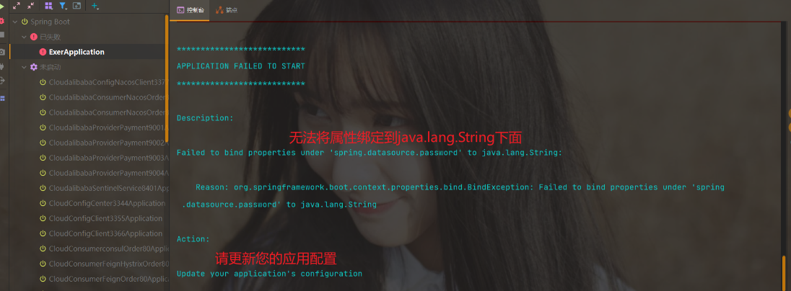

:::warning 需求背景
springboot项目配置yml文件中的密码不能暴露，比如数据库用户名、密码等，如何操作？答案肯定是加密，难道还能不写嘛？哈哈哈哈哈
:::

## 1：前置工作。
### 1）导包
```xml
    <dependency>
        <groupId>com.github.ulisesbocchio</groupId>
        <artifactId>jasypt-spring-boot-starter</artifactId>
        <version>2.1.1</version>
    </dependency>
```

<p style="color:red">这里有个大坑，就是版本分界线的问题，3.0.0是个分界线。我也是解决了一个小时，终于发现是版本解密的问题，最后会说出原因以及如何解决？</p>

### 2）思路
既然要机密解密，那开发者肯定要知道`加密前后的内容`以及`加密的盐`,这些`加密后的内容`应该由开发者人员提供。所以提供一个批处理文件来进行`加密`和`解密`。
- ①：企业中可能是自己实现的加密解密，然后打成了jar包，就是为了简单封装一下，没必要的逻辑，知识为了简化开发。
- ②：我直接利用`jasypt`jar包来进行加密解密，手段是采用`bat文件`来控制`加密解密内容输出`，和企业效果实现一样。

### 3）编写bat脚本。
> 可以循环加密解密，不用关闭重新打开，三个参数

- 第一个是加密解密
- 第二个是加密解密内容
- 第三个是盐

<p style="color:red">然后通过bat脚本来进行控制。</p>

```bat
@chcp 65001 
@echo off
::title
@echo.
title 加解密内容输出：
@echo.
@echo. ~请输入以下内容：
@echo.
@echo.

set /p one=请输入加密解密方式(1加密 2解密)：
@echo.
set /p two=请输入要加解密的内容:
@echo.
set /p three=请输入要加解密的盐:
@echo.

:loop

if %one%==1 (
	java -cp E:\maven\repository\org\jasypt\jasypt\1.9.3\jasypt-1.9.3.jar org.jasypt.intf.cli.JasyptPBEStringEncryptionCLI input=%two% password=%three% algorithm=PBEWithMD5AndDES  
)else if %one%==2 (
	java -cp E:\maven\repository\org\jasypt\jasypt\1.9.3\jasypt-1.9.3.jar org.jasypt.intf.cli.JasyptPBEStringDecryptionCLI input=%two% password=%three% algorithm=PBEWithMD5AndDES
)

set /p one=请输入加密解密方式(1加密 2解密)：
@echo.
set /p two=请输入要加解密的内容:
@echo.
set /p three=请输入要加解密的盐:
@echo.
goto loop

```
### 4）Java获取加密解密
```java
@SpringBootTest
public class EncryptTests {
 
    private static final String ALGORITHM_INFO = "PBEWithMD5AndDES";
 
    private static final String PASSWORD_INFO = "qwert12345";
 
    @Test
    public void contextLoads() {
    }
 
    @Autowired
    StringEncryptor stringEncryptor;
 
    @Test
    public void encryptPwd() {
        StandardPBEStringEncryptor standardPBEStringEncryptor = new StandardPBEStringEncryptor();
        //配置文件中配置如下的算法
        standardPBEStringEncryptor.setAlgorithm(ALGORITHM_INFO);
        //配置文件中配置的password
        standardPBEStringEncryptor.setPassword(PASSWORD_INFO);
        //要加密的文本
        String name = standardPBEStringEncryptor.encrypt("root");
        String password = standardPBEStringEncryptor.encrypt("root");
        String redisPassword = standardPBEStringEncryptor.encrypt("123456");
        //将加密的文本写到配置文件中
        System.out.println("name=" + name);
        System.out.println("password=" + password);
        System.out.println("redisPassword=" + redisPassword);
 
        //要解密的文本
        String name2 = standardPBEStringEncryptor.decrypt("FarrmxSQX5uwtH/NZRxy+g==");
        String password2 = standardPBEStringEncryptor.decrypt("vhiaYB1gl9zPj16yu7uMkA==");
        String redisPassword2 = standardPBEStringEncryptor.decrypt("ZII7UphhbVuJ8c3oxPUeyw==");
        //解密后的文本
        System.out.println("name2=" + name2);
        System.out.println("password2=" + password2);
        System.out.println("redisPassword2=" + redisPassword2);
 
    }
 
}
```

## 2：springboot实现
### 1）导入需要的包
```xml
    <dependency>
        <groupId>com.github.ulisesbocchio</groupId>
        <artifactId>jasypt-spring-boot-starter</artifactId>
        <version>2.1.1</version>
    </dependency>
```

### 2）yml配置
<p style="color:red">这里采用的是2.1.1版本,默认的 iv-generator-classname 是 org.jasypt.iv.RandomIvGenerator,所以写不写无所谓，只需要一个密钥就可以了</p>

> 比如之前我的密码是0开头的，所以它的解析方式不用  
- 1、以0b开头的数字，会被当做二进制数处理
- 2、以0x开头的数字，会被当做十六进制数处理
- 3、以0开头的数字，会被当做八进制数处理
> 解决办法：''包裹  

但是就是我通过bat拿到了加密后的内容，password: 'ENC(E+bqBnmc7SOBiploQdkpgw==)'，肯定是不行的，所以得修改数据库密码，就可以解决这个问题。

```yml
jasypt:
  encryptor:
    password: xiaoze_exer   # 密钥
    pool-size: 1
#    algorithm: PBEWithMD5AndDES
#    iv-generator-classname: org.jasypt.salt.RandomSaltGenerator
#服务端口
spring:
  servlet:
    multipart:
      max-request-size: 30MB
      max-file-size: 1024MB
  application:
    name: exer
  mvc:
    pathmatch:
      matching-strategy: 'ANT_PATH_MATCHER '
  mail:
    # 下面这个是QQ邮箱host ， 企业邮箱 : smtp.exmail.qq.com
    host: smtp.qq.com
    # tencent mail port  这个是固定的
    port: 465
    # 你的QQ邮箱
    username: huhaoze0429@qq.com
    # 进入邮箱配置后得到的授权码
    password: fmjlxvxxajtcdfce
    #test-connection: true
    default-encoding: utf-8
    properties:
      mail:
        smtp:
          auth: true
          starttls:
            enable: true
            required: true
    protocol: smtps
#返回json的全局时间格式
  jackson:
    serialization:
      write-dates-as-timestamps: true
    date-format: yyyy-MM-dd HH:mm:ss
    time-zone: GMT+8
#  cloud:
#    nacos:
#      discovery:
#        server-addr: localhost:8848
  profiles:
    active: dev
  datasource:
    driver-class-name: com.mysql.cj.jdbc.Driver
    url: jdbc:mysql://localhost:3306/collegestudentsloosechangenetwork?useUnicode=true&characterEncoding=UTF-8&serverTimezone=Asia/Shanghai
    username: root
    password: ENC(E+bqBnmc7SOBiploQdkpgw==)  #ENC()是他的固定格式
  redis:
    database: 0
    host: localhost
    port: 6379
mybatis-plus:
#  configuration:
#    log-impl: org.apache.ibatis.logging.stdout.StdOutImpl
  global-config:
    db-config:
      logic-delete-field: deleted # 全局逻辑删除的实体字段名(since 3.3.0,配置后可以忽略不配置步骤2)
      logic-delete-value: 1 # 逻辑已删除值(默认为 1)
      logic-not-delete-value: 0 # 逻辑未删除值(默认为 0)
    mapper-locations: classpath:com/xiaoze/fraulein/mapper/xml/*.xml

qiniu:
  accessKey: zKhTOqWZCDZenbQ2js2-D-WbFGyicyhTbc3tFFyl
  secretKey:  4VWXeZxfD5isbwdSSTyJ6oEHdi9Mnd7wP1wnGOm8
  bucketName:  collegestudent
  path: xiaozestudy.love
server:
  port: 8085
```

## 3：版本比较
### 1）3.0.0之后
```xml
    <dependency>
        <groupId>com.github.ulisesbocchio</groupId>
        <artifactId>jasypt-spring-boot-starter</artifactId>
        <version>3.0.3</version>
    </dependency>
```
我第一次开始的时候导入的是`3.0.3`，这个版本，yml内容不变，就还是只有一个盐，但是我发现它仍然会提示错误，错误内容如下：

结果找资料发现，3.0.0版本之后，官方更改了加密算法，结果导致了这种情况，所以我们在yml中改成官方更新过的加密算法就可以了,必须设置`algorithm`和`iv-generator-classname`。
```yml
jasypt:
  encryptor:
    password: xiaoze_exer   # 密钥
    pool-size: 1
    algorithm: PBEWithMD5AndDES
    iv-generator-classname: org.jasypt.iv.NoIvGenerator
```
### 2）3.0.0之前
就直接导入2.1.1版本的包，直接配置就好了。