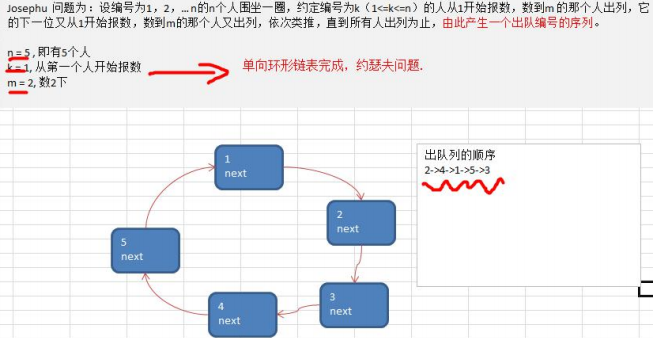
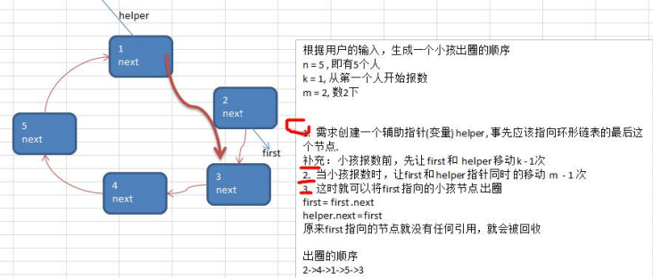

## 1：结构


## 2：约瑟夫环问题

### 2.1 问题
:::warning 约瑟夫环问题
`Josephu` 问题为：设编号为 `1`，`2`，… `n` 的 `n` 个人围坐一圈，约定编号为 `k（1<=k<=n）` 的人从 `1` 开始报数，数 到 `m` 的那个人出列，它的下一位又从 `1` 开始报数，数到 `m` 的那个人又出列，依次类推，直到所有人出列为止，由此产生一个出队编号的序列。
:::

:::warning 提示
用一个不带头结点的循环链表来处理 `Josephu` 问题：先构成一个有 `n` 个结点的单循环链表，然后由 `k` 结 点起从 `1` 开始计数，计到 `m` 时，对应结点从链表中删除，然后再从 **被删除结点的下一个结点** 又从 1 开始计数，直到 **最后一个结点** 从链表中删除算法结束。
:::

### 2.2 示意图


### 2.3  创建环形链表的思路图解


```java
	// 添加小孩节点，构建成一个环形的链表
	public void addBoy(int nums) {
		// nums 做一个数据校验
		if (nums < 1) {
			System.out.println("nums的值不正确");
			return;
		}
		Boy curBoy = null; // 辅助指针，帮助构建环形链表
		// 使用for来创建我们的环形链表
		for (int i = 1; i <= nums; i++) {
			// 根据编号，创建小孩节点
			Boy boy = new Boy(i);
			// 如果是第一个小孩
			if (i == 1) {
				first = boy;
				first.setNext(first); // 构成环
				curBoy = first; // 让curBoy指向第一个小孩
			} else {
				curBoy.setNext(boy);//
				boy.setNext(first);//
				curBoy = boy;
			}
		}
	}
```

### 2.4  小孩出圈的思路分析图



```java
	// 根据用户的输入，计算出小孩出圈的顺序
	/**
	 * 
	 * @param startNo
	 *            表示从第几个小孩开始数数
	 * @param countNum
	 *            表示数几下
	 * @param nums
	 *            表示最初有多少小孩在圈中
	 */
	public void countBoy(int startNo, int countNum, int nums) {
		// 先对数据进行校验
		if (first == null || startNo < 1 || startNo > nums) {
			System.out.println("参数输入有误， 请重新输入");
			return;
		}
		// 创建要给辅助指针,帮助完成小孩出圈
		Boy helper = first;
		// 需求创建一个辅助指针(变量) helper , 事先应该指向环形链表的最后这个节点
		while (true) {
			if (helper.getNext() == first) { // 说明helper指向最后小孩节点
				break;
			}
			helper = helper.getNext();
		}
		//小孩报数前，先让 first 和  helper 移动 k - 1次
		for(int j = 0; j < startNo - 1; j++) {
			first = first.getNext();
			helper = helper.getNext();
		}
		//当小孩报数时，让first 和 helper 指针同时 的移动  m  - 1 次, 然后出圈
		//这里是一个循环操作，知道圈中只有一个节点
		while(true) {
			if(helper == first) { //说明圈中只有一个节点
				break;
			}
			//让 first 和 helper 指针同时 的移动 countNum - 1
			for(int j = 0; j < countNum - 1; j++) {
				first = first.getNext();
				helper = helper.getNext();
			}
			//这时first指向的节点，就是要出圈的小孩节点
			System.out.printf("小孩%d出圈\n", first.getNo());
			//这时将first指向的小孩节点出圈
			first = first.getNext();
			helper.setNext(first); //
			
		}
		System.out.printf("最后留在圈中的小孩编号%d \n", first.getNo());
		
	}
```

### 2.5 代码实现

```java

public class Josepfu {

	public static void main(String[] args) {
		// 测试一把看看构建环形链表，和遍历是否ok
		CircleSingleLinkedList circleSingleLinkedList = new CircleSingleLinkedList();
		circleSingleLinkedList.addBoy(125);// 加入5个小孩节点
		circleSingleLinkedList.showBoy();
		
		//测试一把小孩出圈是否正确
		circleSingleLinkedList.countBoy(10, 20, 125); // 2->4->1->5->3
		//String str = "7*2*2-5+1-5+3-3";
	}

}

// 创建一个环形的单向链表
class CircleSingleLinkedList {
	// 创建一个first节点,当前没有编号
	private Boy first = null;

	// 添加小孩节点，构建成一个环形的链表
	public void addBoy(int nums) {
		// nums 做一个数据校验
		if (nums < 1) {
			System.out.println("nums的值不正确");
			return;
		}
		Boy curBoy = null; // 辅助指针，帮助构建环形链表
		// 使用for来创建我们的环形链表
		for (int i = 1; i <= nums; i++) {
			// 根据编号，创建小孩节点
			Boy boy = new Boy(i);
			// 如果是第一个小孩
			if (i == 1) {
				first = boy;
				first.setNext(first); // 构成环
				curBoy = first; // 让curBoy指向第一个小孩
			} else {
				curBoy.setNext(boy);//
				boy.setNext(first);//
				curBoy = boy;
			}
		}
	}

	// 遍历当前的环形链表
	public void showBoy() {
		// 判断链表是否为空
		if (first == null) {
			System.out.println("没有任何小孩~~");
			return;
		}
		// 因为first不能动，因此我们仍然使用一个辅助指针完成遍历
		Boy curBoy = first;
		while (true) {
			System.out.printf("小孩的编号 %d \n", curBoy.getNo());
			if (curBoy.getNext() == first) {// 说明已经遍历完毕
				break;
			}
			curBoy = curBoy.getNext(); // curBoy后移
		}
	}

	// 根据用户的输入，计算出小孩出圈的顺序
	/**
	 * 
	 * @param startNo
	 *            表示从第几个小孩开始数数
	 * @param countNum
	 *            表示数几下
	 * @param nums
	 *            表示最初有多少小孩在圈中
	 */
	public void countBoy(int startNo, int countNum, int nums) {
		// 先对数据进行校验
		if (first == null || startNo < 1 || startNo > nums) {
			System.out.println("参数输入有误， 请重新输入");
			return;
		}
		// 创建要给辅助指针,帮助完成小孩出圈
		Boy helper = first;
		// 需求创建一个辅助指针(变量) helper , 事先应该指向环形链表的最后这个节点
		while (true) {
			if (helper.getNext() == first) { // 说明helper指向最后小孩节点
				break;
			}
			helper = helper.getNext();
		}
		//小孩报数前，先让 first 和  helper 移动 k - 1次
		for(int j = 0; j < startNo - 1; j++) {
			first = first.getNext();
			helper = helper.getNext();
		}
		//当小孩报数时，让first 和 helper 指针同时 的移动  m  - 1 次, 然后出圈
		//这里是一个循环操作，知道圈中只有一个节点
		while(true) {
			if(helper == first) { //说明圈中只有一个节点
				break;
			}
			//让 first 和 helper 指针同时 的移动 countNum - 1
			for(int j = 0; j < countNum - 1; j++) {
				first = first.getNext();
				helper = helper.getNext();
			}
			//这时first指向的节点，就是要出圈的小孩节点
			System.out.printf("小孩%d出圈\n", first.getNo());
			//这时将first指向的小孩节点出圈
			first = first.getNext();
			helper.setNext(first); //
			
		}
		System.out.printf("最后留在圈中的小孩编号%d \n", first.getNo());
		
	}
}

// 创建一个Boy类，表示一个节点
class Boy {
	private int no;// 编号
	private Boy next; // 指向下一个节点,默认null

	public Boy(int no) {
		this.no = no;
	}

	public int getNo() {
		return no;
	}

	public void setNo(int no) {
		this.no = no;
	}

	public Boy getNext() {
		return next;
	}

	public void setNext(Boy next) {
		this.next = next;
	}

}
```