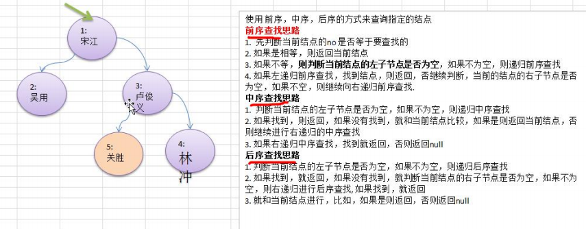
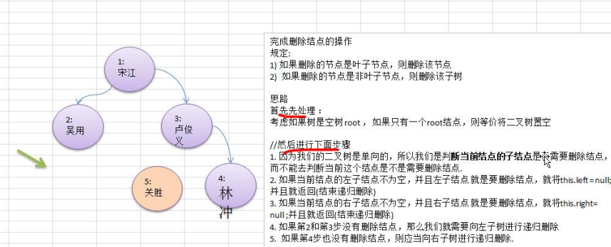

## 1：介绍
二叉树是树形结构的一个重要类型，它的特点是**每个节点最多有两个子节点**。通常，这两个子节点被分别称为 **左子节点** 和 **右子节点**。

### 1.1 基本二叉树

在二叉树中，不存在度大于2的节点。二叉树的子树有左右之分，次序不能颠倒，因此二叉树是有序树。

> 二叉树的基本形态有三种：

- `空二叉树`：没有节点的二叉树，或者说，根节点和节点数为零的二叉树。
- 只有一个根节点的二叉树：此时，左子树和右子树都为空。
- 根节点以及左、右子树都非空的二叉树。

> 根据二叉树的性质，我们可以得到一些重要的结论：

- 在二叉树的第i层上至多有 `2^(i-1)` 个节点 `（i≥1）`。
- 深度为k的二叉树至多有 `2^k - 1` 个节点（`k≥1`）。
- 对任何一棵二叉树T，如果其终端节点数为 `n0`，度为 `2` 的节点数为 `n2` ，则 `n0=n2+1` 。

### 1.2 满二叉树

如果该二叉树的所有叶子节点都在 **最后一层**，并且结点总数= `2^n - 1` , n 为层数，则我们称为 **满二叉树**。


### 1.3 完全二叉树

如果该二叉树的 **所有叶子节点** 都在 **最后一层** 或者 **倒数第二层**，而且 **最后一层的叶子节点在左边连续**，**倒数第二层的叶子节点在右边连续**，我们称为 `完全二叉树`


## 2：二叉树实现

### 2.1 遍历

使用 `前序`，`中序` 和 `后序`对下面的二叉树进行遍历. 
 - 1) `前序遍历`: 先输出 **父节点**，再遍历 **左子树** 和 **右子树**
 - 2) `中序遍历`: 先遍历 **左子树**，再输出 **父节点**，再遍历 **右子树**
 - 3) `后序遍历`: 先遍历 **左子树**，再遍历 **右子树**，最后输出 **父节点** 
 - 4) **`小结`**: 看输出 **父节点的顺序，就确定是前序，中序还是后序**


### 2.2 查找指定节点

- 1) 请编写前序查找，中序查找和后序查找的方法。 
- 2) 并分别使用三种查找方式，查找 heroNO = 5 的节点 
- 3) 并分析各种查找方式，分别比较了多少次 
- 4) 思路分析图解



### 2.3 删除节点

- 1) 如果删除的节点是叶子节点，则删除该节点 
- 2) 如果删除的节点是非叶子节点，则删除该子树. 
- 3) 测试，删除掉 5 号叶子节点 和 3 号子树. 
- 4) 完成删除思路分析
   


### 2.4 代码实现

```java
public class BinaryTreeDemo {

	public static void main(String[] args) {
		//先需要创建一颗二叉树
		BinaryTree binaryTree = new BinaryTree();
		//创建需要的结点
		HeroNode root = new HeroNode(1, "宋江");
		HeroNode node2 = new HeroNode(2, "吴用");
		HeroNode node3 = new HeroNode(3, "卢俊义");
		HeroNode node4 = new HeroNode(4, "林冲");
		HeroNode node5 = new HeroNode(5, "关胜");
		
		//说明，我们先手动创建该二叉树，后面我们学习递归的方式创建二叉树
		root.setLeft(node2);
		root.setRight(node3);
		node3.setRight(node4);
		node3.setLeft(node5);
		binaryTree.setRoot(root);
		
		//测试
//		System.out.println("前序遍历"); // 1,2,3,5,4
//		binaryTree.preOrder();
		
		//测试 
//		System.out.println("中序遍历");
//		binaryTree.infixOrder(); // 2,1,5,3,4
//		
//		System.out.println("后序遍历");
//		binaryTree.postOrder(); // 2,5,4,3,1
		
		//前序遍历
		//前序遍历的次数 ：4 
//		System.out.println("前序遍历方式~~~");
//		HeroNode resNode = binaryTree.preOrderSearch(5);
//		if (resNode != null) {
//			System.out.printf("找到了，信息为 no=%d name=%s", resNode.getNo(), resNode.getName());
//		} else {
//			System.out.printf("没有找到 no = %d 的英雄", 5);
//		}
		
		//中序遍历查找
		//中序遍历3次
//		System.out.println("中序遍历方式~~~");
//		HeroNode resNode = binaryTree.infixOrderSearch(5);
//		if (resNode != null) {
//			System.out.printf("找到了，信息为 no=%d name=%s", resNode.getNo(), resNode.getName());
//		} else {
//			System.out.printf("没有找到 no = %d 的英雄", 5);
//		}
		
		//后序遍历查找
		//后序遍历查找的次数  2次
//		System.out.println("后序遍历方式~~~");
//		HeroNode resNode = binaryTree.postOrderSearch(5);
//		if (resNode != null) {
//			System.out.printf("找到了，信息为 no=%d name=%s", resNode.getNo(), resNode.getName());
//		} else {
//			System.out.printf("没有找到 no = %d 的英雄", 5);
//		}
		
		//测试一把删除结点
		
		System.out.println("删除前,前序遍历");
		binaryTree.preOrder(); //  1,2,3,5,4
		binaryTree.delNode(5);
		//binaryTree.delNode(3);
		System.out.println("删除后，前序遍历");
		binaryTree.preOrder(); // 1,2,3,4
		
		
		
	}

}

//定义BinaryTree 二叉树
class BinaryTree {
	private HeroNode root;

	public void setRoot(HeroNode root) {
		this.root = root;
	}
	
	//删除结点
	public void delNode(int no) {
		if(root != null) {
			//如果只有一个root结点, 这里立即判断root是不是就是要删除结点
			if(root.getNo() == no) {
				root = null;
			} else {
				//递归删除
				root.delNode(no);
			}
		}else{
			System.out.println("空树，不能删除~");
		}
	}
	//前序遍历
	public void preOrder() {
		if(this.root != null) {
			this.root.preOrder();
		}else {
			System.out.println("二叉树为空，无法遍历");
		}
	}
	
	//中序遍历
	public void infixOrder() {
		if(this.root != null) {
			this.root.infixOrder();
		}else {
			System.out.println("二叉树为空，无法遍历");
		}
	}
	//后序遍历
	public void postOrder() {
		if(this.root != null) {
			this.root.postOrder();
		}else {
			System.out.println("二叉树为空，无法遍历");
		}
	}
	
	//前序遍历
	public HeroNode preOrderSearch(int no) {
		if(root != null) {
			return root.preOrderSearch(no);
		} else {
			return null;
		}
	}
	//中序遍历
	public HeroNode infixOrderSearch(int no) {
		if(root != null) {
			return root.infixOrderSearch(no);
		}else {
			return null;
		}
	}
	//后序遍历
	public HeroNode postOrderSearch(int no) {
		if(root != null) {
			return this.root.postOrderSearch(no);
		}else {
			return null;
		}
	}
}

//先创建HeroNode 结点
class HeroNode {
	private int no;
	private String name;
	private HeroNode left; //默认null
	private HeroNode right; //默认null
	public HeroNode(int no, String name) {
		this.no = no;
		this.name = name;
	}
	public int getNo() {
		return no;
	}
	public void setNo(int no) {
		this.no = no;
	}
	public String getName() {
		return name;
	}
	public void setName(String name) {
		this.name = name;
	}
	public HeroNode getLeft() {
		return left;
	}
	public void setLeft(HeroNode left) {
		this.left = left;
	}
	public HeroNode getRight() {
		return right;
	}
	public void setRight(HeroNode right) {
		this.right = right;
	}
	@Override
	public String toString() {
		return "HeroNode [no=" + no + ", name=" + name + "]";
	}
	
	//递归删除结点
	//1.如果删除的节点是叶子节点，则删除该节点
	//2.如果删除的节点是非叶子节点，则删除该子树
	public void delNode(int no) {
		
		//思路
		/*
		 * 	1. 因为我们的二叉树是单向的，所以我们是判断当前结点的子结点是否需要删除结点，而不能去判断当前这个结点是不是需要删除结点.
			1. 如果当前结点的左子结点不为空，并且左子结点 就是要删除结点，就将this.left = null; 并且就返回(结束递归删除)
			2. 如果当前结点的右子结点不为空，并且右子结点 就是要删除结点，就将this.right= null ;并且就返回(结束递归删除)
			3. 如果第2和第3步没有删除结点，那么我们就需要向左子树进行递归删除
			4.  如果第4步也没有删除结点，则应当向右子树进行递归删除.

		 */
		//2. 如果当前结点的左子结点不为空，并且左子结点 就是要删除结点，就将this.left = null; 并且就返回(结束递归删除)
		if(this.left != null && this.left.no == no) {
			this.left = null;
			return;
		}
		//3.如果当前结点的右子结点不为空，并且右子结点 就是要删除结点，就将this.right= null ;并且就返回(结束递归删除)
		if(this.right != null && this.right.no == no) {
			this.right = null;
			return;
		}
		//4.我们就需要向左子树进行递归删除
		if(this.left != null) {
			this.left.delNode(no);
		}
		//5.则应当向右子树进行递归删除
		if(this.right != null) {
			this.right.delNode(no);
		}
	}
	
	//编写前序遍历的方法
	public void preOrder() {
		System.out.println(this); //先输出父结点
		//递归向左子树前序遍历
		if(this.left != null) {
			this.left.preOrder();
		}
		//递归向右子树前序遍历
		if(this.right != null) {
			this.right.preOrder();
		}
	}
	//中序遍历
	public void infixOrder() {
		
		//递归向左子树中序遍历
		if(this.left != null) {
			this.left.infixOrder();
		}
		//输出父结点
		System.out.println(this);
		//递归向右子树中序遍历
		if(this.right != null) {
			this.right.infixOrder();
		}
	}
	//后序遍历
	public void postOrder() {
		if(this.left != null) {
			this.left.postOrder();
		}
		if(this.right != null) {
			this.right.postOrder();
		}
		System.out.println(this);
	}
	
	//前序遍历查找
	/**
	 * 
	 * @param no 查找no
	 * @return 如果找到就返回该Node ,如果没有找到返回 null
	 */
	public HeroNode preOrderSearch(int no) {
		System.out.println("进入前序遍历");
		//比较当前结点是不是
		if(this.no == no) {
			return this;
		}
		//1.则判断当前结点的左子节点是否为空，如果不为空，则递归前序查找
		//2.如果左递归前序查找，找到结点，则返回
		HeroNode resNode = null;
		if(this.left != null) {
			resNode = this.left.preOrderSearch(no);
		}
		if(resNode != null) {//说明我们左子树找到
			return resNode;
		}
		//1.左递归前序查找，找到结点，则返回，否继续判断，
		//2.当前的结点的右子节点是否为空，如果不空，则继续向右递归前序查找
		if(this.right != null) {
			resNode = this.right.preOrderSearch(no);
		}
		return resNode;
	}
	
	//中序遍历查找
	public HeroNode infixOrderSearch(int no) {
		//判断当前结点的左子节点是否为空，如果不为空，则递归中序查找
		HeroNode resNode = null;
		if(this.left != null) {
			resNode = this.left.infixOrderSearch(no);
		}
		if(resNode != null) {
			return resNode;
		}
		System.out.println("进入中序查找");
		//如果找到，则返回，如果没有找到，就和当前结点比较，如果是则返回当前结点
		if(this.no == no) {
			return this;
		}
		//否则继续进行右递归的中序查找
		if(this.right != null) {
			resNode = this.right.infixOrderSearch(no);
		}
		return resNode;
		
	}
	
	//后序遍历查找
	public HeroNode postOrderSearch(int no) {
		
		//判断当前结点的左子节点是否为空，如果不为空，则递归后序查找
		HeroNode resNode = null;
		if(this.left != null) {
			resNode = this.left.postOrderSearch(no);
		}
		if(resNode != null) {//说明在左子树找到
			return resNode;
		}
		
		//如果左子树没有找到，则向右子树递归进行后序遍历查找
		if(this.right != null) {
			resNode = this.right.postOrderSearch(no);
		}
		if(resNode != null) {
			return resNode;
		}
		System.out.println("进入后序查找");
		//如果左右子树都没有找到，就比较当前结点是不是
		if(this.no == no) {
			return this;
		}
		return resNode;
	}
	
}

```

### 2.2 查找指定节点